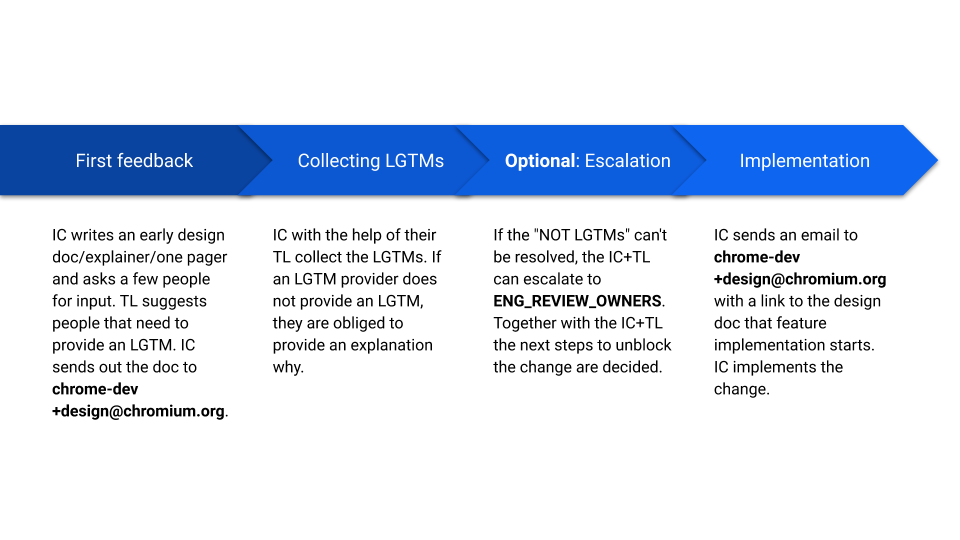

# Chrome DevTools Design Review Guidelines

Please make sure to adhere to the following guidelines when applicable. There are multiple drivers for the formalization of the design process in Chromium DevTools:
1. Make it clear to the Individual Contributor (IC) who the decision makers are and highlight what the path forward is in the case where a project is not proceeding due to technical disagreement.
1. Create a forum to have straight-forward design discussions.
1. Ensure that the Technical Lead (TL) and the Engineering Manager (EnReOw) are aware of all significant changes and give them a chance to comment on designs early on.
1. Increase the involvement of all contributors all over the globe.

## Summary

**Important:**
1. Assume good intentions.
1. Be kind and civilized.
1. Be pragmatic.

The proposed workflow in here is based on the following assumptions and pillars:
1. Put the IC in charge. They are the ones who facilitate the process.
1. The technical leaders (TL, EnReOw) are tasked to help the ICs navigate the territory and find the right LGTM providers.
1. If a feature is uncontroversial, nearly no overhead should be created.
1. If there's a lot of controversy, the feature can be escalated to a dedicated design review meeting where future steps are decided.

## Roles
### Individual Contributor (IC)
*LGTM*: N/A
This person is the creator of the feature and the creator of the design documentation.

### The Technical Leads (TL)
*LGTM*: Must have
An LGTM is needed from the DevTools TLs, which are Benedikt Meurer (bmeurer@chromium.org) and Rob Paveza (Rob.Paveza@microsoft.com) at this point, in order to ensure architectural consistency. The TLs are also responsible for finding the right LGTM providers (i.e. the domain experts) to sign off on the design.

In the absence of the TLs, the EnReOw takes over the responsibility.

### LGTM provider
*LGTM*: Must have
This is a person that is required to give LGTM. These are usually ICs which have significant knowledge about the areas in question.

### “Random” reviewer of the document (RRotD)
*LGTM*: Not required
This is somebody who is simply reviewing and comment on the proposal. Their input should be considered, although their LGTM is not required.

### The Eng Review Owners (EnReOw)
*LGTM*: Not required
Stuck proposals can be escalated to the [ENG_REVIEW_OWNERS](https://cs.chromium.org/chromium/src/third_party/devtools-frontend/src/ENG_REVIEW_OWNERS) Potential use cases of such an escalation:
- An LGTM provider is non-responsive.
- No consensus on the design can be reached.
The EnReOw can overrule non-LGTMs or LGTMs.

## Detailed workflow

1. Start: IC decides to work on a feature/gets a feature assigned to them
1. IC sends out their early design doc/explainer/one pager to a few RRotDs
   - Prototypes are considered part of the "design doc"
1. IC adds people to the list of LGTM providers that the IC thinks should give their LGTM. The TL is a must have on the list of LGTM providers.
1. IC incorporates feedback.
1. TL adds more people to the list of LGTM providers.
1. IC sends out the early design doc based on the Chromium DevTools design template to devtools-dev+design@chromium.org (please make sure to give comment access to contributors@chromium.org, remembering to untick the "Notify" checkbox).
1. IC collects the LGTMs. TL helps them.
  1. LGTM provider reviews document, add comments and gives either an LGTM or not LGTM at the beginning of the document. If they add a not LGTM, they are obligated to list the reason(s).
  1. Optional: LGTM providers can remove themselves from the list of LGTM providers and/or suggest other LGTM providers
  1. IC and TL work to resolve the unresolved issues.
  1. If all LGTM are gathered send an email to devtools-dev@chromium.org (e.g. by pinging the original thread) and announce implementation.
1. Optional: If IC and TL are blocked and/or want to have a broader discussion they can escalate the issue to the EnReOw.
  1. IC sends a mail to the EnReOw
    1. TL in CC
    1. Link to design doc in the mail
  1. The EnReOw is obligated to review the doc and optionally add himself to the list of LGTM providers.
  1. Next steps to unblock the feature are decided.
  1. If the blocker is not resolved afterwards or new, unresolvable blockers are discovered, goto 8.
1. Optional: If "not LGTMs" are added after the feature was approved already, they should be treated like normal, unresolved issues.
  - IC and TL work to resolve the unresolved issues.
1. End: IC proceeds with the feature.

*And always remember*:
- Assume good intentions.
- Be kind and civilized.
- Be pragmatic.

## FAQ
### How to decide if the feature is worthy to have a design document?
Some pointers when a design doc is appropriate:
- Touches at least two components
- Needs reconciliation with non-DevTools projects e.g. V8, Blink
- Take longer than 1 week of effort to implement
- It is a new web platform capability
- Platform specific code will be touched
- User facing (UX) changes or additions
When in doubt, ask the TL.

### How to decide who to add to the list of LGTM providers?
Some pointers when people should be added to the list of LGTM providers:
- OWNERs of the source files/directories you anticipate to touch
- Main component expert of the components you anticipate to touch
- Downstream consumers of your changes e.g. when you change an API

### Where can I find a template for design documents?
[Here](http://bit.ly/devtools-design-doc-template).

### What if something big changes?
Make sure you still have the LGTMs e.g. by pinging the LGTM providers with a clear, reasonable deadline to veto.

### LGTM providers don’t comment on my doc, what should I do?
In this case you can follow this path of escalation:
1. Ping them directly via mail, chat or comment/assignment in the doc and specifically ask them explicitly to add an LGTM or non-LGTM.
1. Get your TL involved and ask them for help.
1. Escalate to EnReOw.

### Somebody added me as an LGTM provider to a doc, what should I do?
Chromium DevTools is aiming to make decisions more transparent and escalation more straight-forward. If you think the design is good enough and should be done add an “LGTM” to the table cell next to your name.
If you have blocking concerns or remarks, please add “Not LGTM, because <reason>” into the table cell next to your name. Be prepared to get asked for another round of review.

### How does this work together with the Blink Intents process?
The Chromium DevTools Design Review Guidelines complement [Chromiums feature launch process](https://www.chromium.org/blink/launching-features). If you are launching a new Web platform feature, please follow the Chromium launch process. It likely makes sense to have all the LGTMs gathered at the point in time you would send an Intent to Implement.

