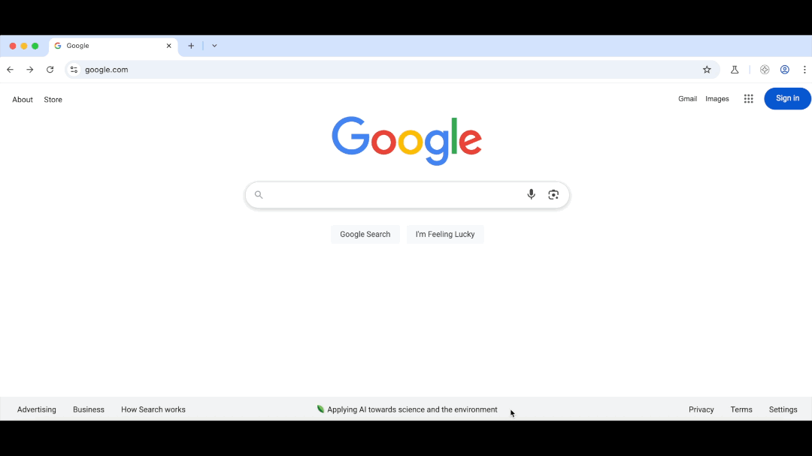

# Browser Operator - Open Source Agentic Browser


[](LICENSE)

**The first open-source, privacy-friendly AI browser that transforms how you work on the web. Your intelligent partner for research, analysis, and automation - all running locally in your browser.**



## 🚀 Download & Get Started

**[⬇️ Download Browser Operator for macOS](https://github.com/tysonthomas9/browser-operator-devtools-frontend/releases)**

Or build from source: [Developer Setup Guide](front_end/panels/ai_chat/Readme.md)

## 🎬 See It In Action

### Deep Research & Analysis
Watch Browser Operator synthesize information from multiple sources, creating comprehensive research reports without manual copying and pasting.


https://github.com/user-attachments/assets/225319db-c5a0-4834-9f37-5787fb646d16


### Smart Shopping Assistant
See how it automatically compares products, analyzes reviews, and helps you make informed purchasing decisions.

https://github.com/user-attachments/assets/c478b18e-0342-400d-98ab-222c93eecd7a

### Professional Research
Discover how businesses use Browser Operator for talent search, competitive analysis, and market research.

https://github.com/user-attachments/assets/90150f0e-e8c8-4b53-b6a6-c739f143f4a0

## ✨ Key Features

### 🤖 Intelligent Automation
- **Multi-Agent Framework**: Specialized agents work together to handle complex tasks
- **Autonomous Navigation**: Understands and interacts with any website
- **Smart Actions**: Click, fill forms, extract data, and navigate without manual scripting
- **Adaptive Learning**: Improves task execution based on patterns and feedback

### 🔒 Privacy First (Use local LLM)
- **Local Processing**: Your data never leaves your machine
- **No Cloud Dependencies**: Full functionality without sending data to external servers
- **Secure Sessions**: Works with your existing browser authentication
- **Open Source**: Complete transparency in how your data is handled

### 🧩 Extensible Platform
- **100+ AI Models**: Support for OpenAI, Claude, Gemini, Llama, and more
- **Custom Workflows**: Build your own automation sequences
- **Plugin Architecture**: Extend functionality with custom agents
- **API Integration**: Connect with your existing tools and services

## 💡 What Can You Build?

<table>
<tr>
<td width="50%">

**Personal Productivity**
- 📚 Literature reviews and research papers
- 🛍️ Price tracking and comparison shopping  
- 📰 News aggregation and summarization
- 📊 Data collection and analysis
- ✈️ Travel planning and booking research

</td>
<td width="50%">

**Business Intelligence**
- 🔍 Competitive analysis and monitoring
- 👥 Talent sourcing and recruitment
- 📈 Market research and trends
- 🏢 Lead generation and qualification
- 📋 Compliance and audit automation

</td>
</tr>
</table>

## 🛠️ Technical Architecture

Browser Operator combines a Chromium-based browser with an advanced agentic framework:

```
┌─────────────────────────────────────────────────┐
│             Browser Operator UI                 │
├─────────────────────────────────────────────────┤
│          Multi-Agent Orchestrator               │
├──────────────┬────────────────┬─────────────────┤
│ Research     │  Navigation    │   Analysis      │
│ Agent        │  Agent         │   Agent         │
├──────────────┴────────────────┴─────────────────┤
│            Chromium Browser Engine              │
└─────────────────────────────────────────────────┘
```

### Core Components
- **Orchestrator Agent**: Coordinates multi-agent workflows and task distribution
- **Navigation Engine**: Handles web interactions and page understanding
- **Tool Registry**: Extensible system for adding new capabilities
- **State Management**: Maintains context across complex workflows

[Full Technical Documentation →](front_end/panels/ai_chat/Readme.md)

## ⚙️ Quick Setup

### For Users: Pre-built Application

1. [Download the latest release](https://github.com/tysonthomas9/browser-operator-devtools-frontend/releases)
2. Open Browser Operator
3. Configure your AI provider (see below)
4. Start automating!

### For Developers: Build from Source

```bash
# Clone the repository
git clone https://github.com/tysonthomas9/browser-operator-devtools-frontend.git

# Follow the detailed build instructions
cd browser-operator-devtools-frontend
# See front_end/panels/ai_chat/Readme.md for complete setup
```

### AI Provider Configuration

<details>
<summary><b>Option 1: OpenAI (Recommended for beginners)</b></summary>

1. Get an API key from [OpenAI Platform](https://platform.openai.com)
2. Open Browser Operator settings
3. Select "OpenAI" as provider
4. Enter your API key
5. Choose a model (GPT-4.1 recommended)
6. Save and start using!

</details>

<details>
<summary><b>Option 2: LiteLLM (For multiple providers)</b></summary>

Perfect for using multiple AI providers or self-hosted models:

1. Set up your LiteLLM proxy server
2. Select "LiteLLM Provider" in settings
3. Enter proxy URL and API key
4. Click "Fetch Models" to verify connection
5. Select your preferred model

[LiteLLM Setup Video →](https://github.com/user-attachments/assets/579dcfdc-71c8-4664-87b8-c2b68cc5c1ce)

</details>

<details>
<summary><b>Option 3: Local Models (Maximum privacy)</b></summary>

Run completely offline with Ollama:

1. Install Ollama on your system
2. Pull your preferred model (e.g., `ollama pull llama3`)
3. Configure Browser Operator to use local endpoint
4. Enjoy private, offline automation

</details>

## 🗺️ Roadmap

### ✅ Released
- Multi-agent workflow engine
- Support for 100+ AI models
- macOS application
- Core automation capabilities

### 🚧 In Development
- Windows and Linux support
- Enhanced memory system
- Custom agent builder

### 🔮 Planned Features
- MCP (Model Context Protocol) support
- Visual workflow designer
- Team collaboration features
- Advanced scheduling system

## 👥 Community & Support

### Get Help
- 📖 [Documentation](front_end/panels/ai_chat/Readme.md)
- 💬 [Discord Community](https://discord.gg/fp7ryHYBSY)
- 🐛 [Report Issues](https://github.com/tysonthomas9/browser-operator-devtools-frontend/issues)
- 🐦 [Follow Updates](https://x.com/BrowserOperator)

### Contributing

We welcome contributions! Here's how you can help:

- **🐛 Report Bugs**: Help us identify and fix issues
- **✨ Request Features**: Share your ideas for new capabilities
- **📝 Improve Docs**: Help others get started
- **💻 Submit PRs**: Contribute code improvements

See our [Contributing Guide](CONTRIBUTING.md) for details.

## 📚 Documentation

- [Getting Started Guide](front_end/panels/ai_chat/docs/GettingStarted.md)
- [Agent Framework](front_end/panels/ai_chat/agent_framework/Readme.md)
- [Creating Custom Agents](front_end/panels/ai_chat/core/Readme.md)
- [Architecture Overview](front_end/panels/ai_chat/docs/Architecture.md)
- [Build Instructions](front_end/panels/ai_chat/docs/PreBuilt.md)

## 🙏 Acknowledgments

Browser Operator is built on top of Chromium and integrates with numerous open-source projects. Special thanks to all contributors and the open-source community.

## 📄 License

Browser Operator is released under the [BSD-3-Clause License](LICENSE).

---

<div align="center">

**⭐ Star this repo to support open-source AI development!**

</div>