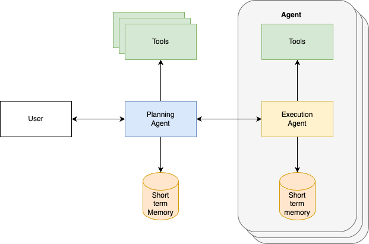

# Browser Operator [Chrome DevTools with Agentic Framework]

This version provides an user interface to run multi-agent workflows directly on the browser using a stateful, orchestration framework.

## Key Capabilities

* Built in Agent Framework for running tasks / workflows.
* Ability to perform actions such as: Navigate URLs, Perform Actions (Clicks, Fill Form, Scroll).
* Access to rendered web page with ability to summarize content.
* Integrates with LLM Models (OpenAI GPT-4.1 and O4-Mini Models).
* Customize workflows or agent behavior with config changes.

## Demos

Watch Browser Operator in action with our demo videos:

#### Overview Demo
See how Browser Operator transforms your browser into an intelligent agentic platform.

https://github.com/user-attachments/assets/d6ffc034-ca38-4afa-861e-c65b3ec79906

#### Deep Research
Browser Operator seamlessly integrates public web data with your private documents and knowledge bases, creating comprehensive research without switching between tools.

https://github.com/user-attachments/assets/225319db-c5a0-4834-9f37-5787fb646d16

#### Product Discovery & Comparison
Streamline your shopping research by automatically gathering specifications, user ratings, and availability across retailers, to help you make confident purchasing decisions.

https://github.com/user-attachments/assets/c478b18e-0342-400d-98ab-222c93eecd7a

#### Professional Talent Search
Efficiently discover and evaluate potential candidates based on skills, experience, and portfolio quality, creating detailed profiles for recruitment decision-making.

https://github.com/user-attachments/assets/90150f0e-e8c8-4b53-b6a6-c739f143f4a0

### Quick Roadmap

|Features| Status |
|--|--|
| Multi-Agent Workflow | Completed |
| OpenAI LLM | Completed |
| Local LLM | |
| MCP | |
| Customize Prompt in UI| |
| Customize Agents in UI| |
| Customize Workflow Graphs in UI| |
| Eval Management | |
| Memory | |
| A2A Protocol | |

### Steps to run project

[Download the pre-built Chromium Browser for MacOS](front_end/panels/ai_chat/docs/PreBuilt.md)

Or

[Set up the dev tools on your system](front_end/panels/ai_chat/Readme.md)

### DevTools Documentation

- [Agentic Framework Documentation](front_end/panels/ai_chat/Readme.md)
- [Chromium Devtools Original Documentation](https://chromium.googlesource.com/devtools/devtools-frontend/+/main/docs/README.md)

### Agentic Framework Documentation

*   [`front_end/panels/ai_chat/core/Readme.md`](front_end/panels/ai_chat/core/Readme.md): Explains how to customize the `BaseOrchestratorAgent` to add new top-level agent types and UI buttons, and details its graph-based workflow.
*   [`front_end/panels/ai_chat/agent_framework/Readme.md`](front_end/panels/ai_chat/agent_framework/Readme.md): Describes the AI Agent Framework, its core components (`ConfigurableAgentTool`, `AgentRunner`, `ToolRegistry`), and how to create, configure, and register new custom agents, including agent handoff mechanisms.

### Contributing

Found a bug 🐛 or have a feature idea ✨? Please create issues [here](https://github.com/tysonthomas9/browser-operator-devtools-frontend/issues)

### Join Us

If you like this project, don't hesitate to ⭐ star this repository. For those who'd like to contribute code or just hang out with the community please join our Discord.

[-000000?style=for-the-badge&logo=x&logoColor=white)](https://x.com/BrowserOperator)
