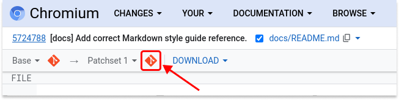

# Chromium DevTools docs

[goo.gle/chromium-devtools](http://goo.gle/chromium-devtools)

This directory contains [Chrome DevTools] project
documentation in [Gitiles-flavored Markdown]. It is automatically
[rendered by Gitiles].

[Chrome DevTools]: https://developer.chrome.com/docs/devtools/
[Gitiles-flavored Markdown]: https://gerrit.googlesource.com/gitiles/+/master/Documentation/markdown.md
[rendered by Gitiles]: https://chromium.googlesource.com/devtools/devtools-frontend/+/main/docs/

**If you add new documents, please also add a link to them in the [Document Index](#Document-Index)
below.**

[TOC]

## Document Index

### Design Documents

*   See the shared [Design Documents](https://drive.google.com/drive/folders/1JbUthATfybvMQR3yAHC4J0P7n6oftYNq) folder in the Chromium drive.

### General Development

*   [Get the Code](./get_the_code.md)
*   [Contribution Guide](./contributing/README.md)
*   [UX Style Guide](./styleguide/ux/README.md)
*   [Testing Guide](../test/README.md)
*   [Cookbook](./cookbook/README.md)
*   [Visual logging in DevTools](../front_end/ui/visual_logging/README.md)
*   [Style Guides](./styleguide/README.md)

### Architectural Documentation

*   [Architecture of DevTools](architecture_of_devtools.md)
*   [Chrome DevTools Protocol (CDP)](devtools-protocol.md)
*   [Resource management in DevTools](resource_management.md)

### Chromium

*   [Chromium Docs](https://chromium.googlesource.com/chromium/src/+/main/docs/README.md)
*   [V8 Documention](https://v8.dev/docs)

### Checklists

*   [DevTools UI feature checklist](./checklist/ui.md)
*   [DevTools support checklist for Blink Intents](./checklist/README.md)
*   [DevTools support checklist for JavaScript features](./checklist/javascript.md)
*   [DevTools support checklist for WebAssembly features](./checklist/webassembly.md)

### Useful Commands

`git cl format --js`

Formats all code using clang-format.

`npm run check`

Runs all static analysis checks on DevTools code.


## Creating Documentation

### Guidelines

*   See the [Chromium Documentation Guidelines](https://chromium.googlesource.com/chromium/src/+/refs/heads/main/docs/documentation_guidelines.md)
    and the
    [Chromium Documentation Best Practices](https://chromium.googlesource.com/chromium/src/+/refs/heads/main/docs/documentation_best_practices.md).
*   Markdown documents must follow the
    [Markdown style guide](styleguide/markdown/markdown.md).

### Previewing changes

#### Locally using [md_browser](https://chromium.googlesource.com/chromium/src/+/refs/heads/main/tools/md_browser)

Assuming that `/path/to/src` contains a chromium checkout, you can run:

```bash
# in devtools-frontend checkout
/path/to/src/tools/md_browser/md_browser.py --directory $PWD
```

and preview the result by opening http://localhost:8080/docs/README.md in your browser. This is only an estimate. The **gitiles** view may differ.

#### Online with Gerrit's links to gitiles

1.  Upload a patch to gerrit, or receive a review request.
    e.g. https://chromium-review.googlesource.com/c/3362532
2.  View a specific .md file.
    e.g. https://chromium-review.googlesource.com/c/3362532/2/docs/README.md
3.  You will see something like <br>
     <br>
    at the top left of the page. Click on the second
    "[preview](https://chromium.googlesource.com/chromium/src/+/refs/changes/32/3362532/3/docs/README.md)"
    link to open the preview for the current patch set.

This **gitiles** view is the authoritative view, exactly the same as will be
used when committed.
