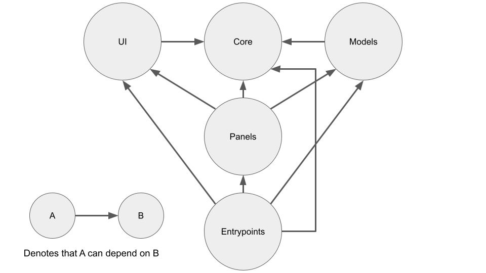

# Architecture of DevTools

This document explains the high-level architecture as well as any considerations that were made along the way.
The document is evolving and will be updated whenever architectural changes are being made.

## Guiding principles

Throughout this document, references are included to relevant [Web Platform Design Principles], whenever they are applicable for that specific section.
It is recommended to be familiar with the Web Platform Design Principles prior to reading to this document, but it is not required.
There are additional DevTools-specific guiding principles that are listed in this section.

### Load only what is necessary

DevTools is a large web application.
It contains dozens of features, most of them are distinct.
As such, loading all features up front is infeasible and can lead to large startup times of DevTools.
The DevTools architecture should encourage granular implementations of features, lazy loading the minimal amount of code to make features work.

See also:
* [Put user needs first]

### Prefer web platform features whenever possible

DevTools ships as part of Chromium-based browsers and therefore is long-living.
Code that is shipped today can live on for years, even decades.
Therefore, web best practices constantly evolve during the lifespan of DevTools.
To avoid frequent rewrites of features, each feature should be implemented with longevity in mind.
Web platform features are standardized and designed to be supported ad infinitum.
Whenever possible, prefer the usage of web platform features over custom solutions, as custom solutions require constant maintenance and are more likely to become out-of-date.

See also:
* [Prefer simple solutions]
* [Put user needs first]

### Design with continuous deployment in mind

DevTools ships every single day in Canary builds of Chromium-based browsers.
It is therefore risky to halt development during a migration (even for a couple of weeks), as DevTools can cause Canary builds to break and effect not just end-users, but also engineers working on the web platform itself.
The symbiosis of the web platform and DevTools means that DevTools itself must be kept up-to-date, to support a continuously evolving platform.

Migrations should therefore be gradual and allow for continuous deployment of DevTools in Canary builds.
The migrations will thus have to take into account not just the desired end solution, but also the limitations of today's implementation.
In the end, it is not possible to predict when migrations are completed, which means that the codebase can be under migration for a significant amount of time.
Ensure that migrations do not (strongly) negatively impact feature development and evolution of the wider web platform and can be completed in a timely fashion.

See also:
* [Put user needs first]
* [Prefer web platform features whenever possible]

### Use flexible third_party libraries whenever necessary

Not all requirements of DevTools can be fulfilled by web platform features alone.
There will be situations in which third_party libraries (ideally closely built on top of web platform features) are the appropriate solution.
Every third_party library introduced in DevTools adds risk to the longterm maintenance of the overall product.
Therefore, each third_party library that DevTools uses should be flexible: a library should be (relatively) easy to be removed from the product.

In practice, this means that any new third_party library must allow for gradual introduction in the codebase, but (if required) also gradually removal.
Since third_party libraries can become unmaintained, gradual removal allows continued development of DevTools features, while the impact of the deprecation is dealt with.
If a third_party library is difficult to remove and has a broad impact on the overall codebase, it could cause a halt of development of DevTools features.
Since the web platform is continuously evolving and DevTools is a part of the platform focused on web developers, halting feature development can have a negative impact on the wider web platform.

Concretely, the introduction of a framework that takes control of the lifecycle of (parts of) DevTools is practically impossible.
Such frameworks require difficult-to-execute migrations and typically don't allow for gradual removals.
Moreover, decisions made by maintainers of third_party frameworks could cause significant maintenance churn for DevTools maintainers.

Note that in this section, the definition of "framework" can differ based on point-of-views of stakeholders and could apply more broadly than initially expected.
Make sure to evaluate third_party packages based on impact on the DevTools codebase, which could be larger than third_party maintainers might have intended.
In other words: even if a third_party package is advertised as a library, it could still be considered as a framework from the perspective of DevTools maintainers.

See also:
* [Load only what is necessary]
* [Design with continuous deployment in mind]

### Limit implementation possibilities while providing maximum flexibility

Typically, there are multiples ways to implement application features on the web.
A direct result of the flexibility of the web is the proliferation of different solutions to the same problem.
A negative consequence of the flexibility is the wide variety of solutions and corresponding maintenance cost in the longterm future.
The DevTools architecture should limit the amount of possible solutions to various problems, yet providing maximum flexibility to engineers implementing DevTools features.

Sadly, that is easier said than done.
Even when taking this principle into account when working on DevTools' architecture, it can be relatively easy to discover "architectural regressions" years later.
On the flipside, it can be appealing to be overly restrictive, to avoid such "architectural regressions".
However, "unnecessary" (this qualification can be subjective and differ based on point-of-view) restrictions can have a strong negative impact on development of DevTools features and therefore can cause more problems on its own.

Balancing the architectural requirements to ensure a stable and fast-loading DevTools versus the needs of implementing new DevTools features is a continuously evolving process.
To ensure a healthy balance, a periodic evaluation can be useful to address potential architectural technical debt.

See also:
* [Prefer simple solutions]
* [Load only what is necessary]

# Build system

Since DevTools is a complex application that integrates with Chromium, it is built on top of the Chromium build system [GN] built on top of [Ninja].
The build system ensures that all relevant files are correctly defined for consumption by Chromium.
It also integrates with (third_party) tooling such as a type checker ([TypeScript]) and upstream Chromium packages ([Chrome DevTools Protocol]).

DevTools-specific GN templates are defined in [scripts/build/ninja/](../scripts/build/ninja/).
Chromium consumes the output of the DevTools GN target [:generate_devtools_grd defined in BUILD.gn](../BUILD.gn), which generates a GRD bundle using [GRIT].
Detailed descriptions about each template are included in [scripts/build/ninja/README.md](../scripts/build/ninja/README.md).

# Startup process overview

DevTools startup process is based on a core-feature model.
The application builds on top of a core of common functionality that is shared between features.
The core is responsible for communicating with the Chromium backend and building a foundation of UI functionality to facilitate the definition of higher-level panels containing features.
Each feature is declared upfront and lazily loaded whenever the user interacts with the feature [[Load only what is necessary]].

Loading of core functionality and features is built on top of [JavaScript modules].
Core functionality is loaded via static imports, while implementations of features is lazily loaded using [dynamic imports].
Features themselves use static imports for loading core and feature-specific functionality.


Enforcement of the rules regarding loading is implemented using the [ESLint] rule defined in [scripts/eslint_rules/lib/es_modules_import.js](../scripts/eslint_rules/lib/es_modules_import.js).

## DevTools application entrypoints

There are multiple variants of the DevTools application.
The main DevTools application is [devtools_app.ts](../front_end/entrypoints/devtools_app/devtools_app.ts), which developers can open via F12 or "Right click -> Inspect element" in their Chromium browser.
Other application entrypoints are a dedicated tool for debugging Node on which multiple targets can be inspected ([node_app.ts](../front_end/entrypoints/node_app/node_app.ts)), a non-browser context debugger for V8 targets ([js_app.ts](../front_end/entrypoints/js_app/js_app.ts)), a (service) worker context ([worker_app.ts](../front_end/entrypoints/worker_app/worker_app.ts)), remote debugging of (Android) devices ([inspector.ts](../front_end/entrypoints/inspector/inspector.ts)) and a basic version of DevTools which was initially intended for non-browser targets but doesn't have any particular use case that differentiates it from the other variants ([ndb_app.ts](../front_end/entrypoints/ndb_app/ndb_app.ts)).

Each application entrypoint has a corresponding `.html` file with the same name, that is automatically in the frontend generated and can be loaded by the Chromium DevTools backend.
The JavaScript files import the relevant "meta" files containing the declarations of DevTools features.

## Upfront declaration of DevTools features

The upfront declaration of DevTools features is also known as "extensions".
Extensions add functionality to the DevTools application using declarative registration calls.

There are multiple types of extensions, including how DevTools handles its own internal business logic or to declare user-facing features with localized strings.
There are 4 main types of extensions:

* [UI.ActionRegistration.Action](../front_end/ui/legacy/ActionRegistration.ts)
* [UI.View.View](../front_end/ui/legacy/View.ts)
* [Common.Settings.Setting](../front_end/core/common/Settings.ts)
* General type lookups.

Each specific extension is documented in the README of their respective folder.

The registration of a particular extension implemented in `module` must always be declared in a `<module>-meta.ts` in the same folder.
The meta files should be included by all relevant DevTools application entrypoints.
If you want to make functionality available in all DevTools application entrypoints, you can import it in [shell.ts](../front_end/entrypoints/shell.ts).

For example, the meta declaration file for [front_end/panels/network/](../front_end/panels/network/) is called [front_end/panels/network/network-meta.ts](../front_end/panels/network/network-meta.ts) and defined in [front_end/panels/network/BUILD.gn](../front_end/panels/network/BUILD.gn):

```python
devtools_entrypoint("meta") {
	entrypoint = "network-meta.ts"
	deps = [
		":bundle",
		"../root:bundle",
		"../ui:bundle",
	]
}
```

Below is an example implementation of a `<module>-meta.ts` (using [front_end/panels/network/network-meta.ts](../front_end/panels/network/network-meta.ts) as running example).
For information about the localization system, please see [l10n.md](l10n.md).

```ts
// Any static imports on core modules
import * as Common from '../common/common.js';
import * as UI from '../ui/ui.js';

// A type-import that is removed during compilation by TypeScript. Therefore,
// it is not a static import on runtime and adheres to the lazy loading
// rules defined for the startup process.
import type * as Network from './network.js';

import * as i18n from '../i18n/i18n.js';
const UIStrings = {
    // UIStrings definitions here
};
const str_ = i18n.i18n.registerUIStrings('network/network-meta.ts', UIStrings);
// Since meta files are loaded synchronously during startup, the localization system
// has not finished loading yet and we need to lazily compute localized strings.
const i18nLazyString = i18n.i18n.getLazilyComputedLocalizedString.bind(undefined, str_);
// The result of the dynamically loaded module. Will be undefined until the user has
// started using a feature defined in this module.
let loadedNetworkModule: (typeof Network|undefined);

// Lazily load the functionality for the network panel. This function will only dynamically
// import the module once.
async function loadNetworkModule(): Promise<typeof Network> {
  if (!loadedNetworkModule) {
    // Dynamic import to load `front_end/network/network.ts`, which contains the
    // actual implementation of the Network panel.
    loadedNetworkModule = await import('./network.js');
  }
  return loadedNetworkModule;
}

// Retrieve any context types from the lazily loaded module, but only if the module has
// already been loaded at least once. The context types are used to determine the availibility
// of certain DevTools extensions, for example certain feature-specific command menu entries
// like the debugger actions when debugging source code. For more information, see the usage
// of this function down below.
function maybeRetrieveContextTypes<T = unknown>(getClassCallBack: (loadedNetworkModule: typeof Network) => T[]): T[] {
  if (loadedNetworkModule === undefined) {
    return [];
  }
  return getClassCallBack(loadedNetworkModule);
}

// A top-level panel. This is the main extension for a high-level feature. The panel is
// loaded whenever the user clicks on the panel tab or loads it via the "More Tools" menu.
// For more information about view extensions, please see the documentation in
// `front_end/ui/View.js`.
UI.ViewManager.registerViewExtension({
  location: UI.ViewManager.ViewLocationValues.PANEL,
  id: 'network',
  commandPrompt: i18nLazyString(UIStrings.showNetwork),
  title: i18nLazyString(UIStrings.network),
  order: 40,
  // This function is executed by the `ViewManager` (defined in `front_end/ui/ViewManager.js`)
  // whenever the user requests the panel to be loaded.
  async loadView() {
    // Lazily load the module, if we hadn't loaded it already.
    const Network = await loadNetworkModule();
    // Obtain a singleton reference to the network panel. We don't allow multiple instances
    // of the same panel, to ensure a performant application.
    return Network.NetworkPanel.NetworkPanel.instance();
  },
});

// A keybinding that is only active when the network panel is open and visible for
// the user. It can hide the detailed network request information when the user has
// clicked on a specific network request.
// For more information about action extensions, please see the documentation in
// `front_end/ui/ActionRegistration.ts`.
UI.ActionRegistration.registerActionExtension({
  actionId: 'network.hide-request-details',
  category: UI.ActionRegistration.ActionCategory.NETWORK,
  title: i18nLazyString(UIStrings.hideRequestDetails),
  // If this function is not defined, this action is considered global.
  // For more detailed documentation about the definition and usage of `contextTypes`,
  // please see the `ActionRegistration` interface.
  contextTypes() {
    // This will return an array of relevant context types that should be loaded
    // and visible to the user for this action to be available in the command
    // menu or when the corresponding keybinding is invoked.
    return maybeRetrieveContextTypes(Network => [Network.NetworkPanel.NetworkPanel]);
  },
  // Just like the network panel, lazily load the action definition when requested by
  // the user.
  async loadActionDelegate() {
    const Network = await loadNetworkModule();
    return Network.NetworkPanel.ActionDelegate.instance();
  },
  bindings: [
    {
      shortcut: 'Esc',
    },
  ],
});
```

The ":meta" `devtools_entrypoint` is added as a dependency to all DevTools application entrypoints defined in [front_end/BUILD.gn](../front_end/BUILD.gn).

# Folder structure

DevTools frontend is divided in multiple folders:

- `core/` includes code that can be used by any other module.
It typically includes utility functions as well as integration with backend.
- `models/` includes business logic and handling of data received from the backend.
- `panels/` includes high-level panels and top-level features.
Each panel typically maps to a separate panel in DevTools, but some panels are integrated into others.
- `ui/components/` includes reusable components that can be used to build multiple panels.
- `ui/legacy/components/` includes legacy components.
Please favor using `ui/components` wherever possible.
- `entrypoints/` includes all entrypoints of DevTools, which can compose a variety of DevTools panels.

In general, the following structure is applicable to dependencies between modules:



- `core/` can be imported by any module
- `models/` can be imported by `panels/` and `entrypoints/`
- `ui/` can be imported by `panels/` and `entrypoints/`
- `panels/` can be imported by `entrypoints/`

To enforce module imports adhere to these rules, actions specify their [GN `visibility` rules].
An example bundle that is defined in `models/workspace_diff/BUILD.gn`:

```python
devtools_entrypoint("bundle") {
  entrypoint = "workspace_diff.ts"

  deps = [ ":workspace_diff" ]

  visibility = [
    # Allow importing in this same module
    ":*",
    # Only these two panels are allowed to use `workspace_diff`
    "../../panels/changes/*",
    "../../panels/sources/*",
  ]

  # Used to allow overrides for downstream projects. Please see below for more information
  visibility += devtools_models_visibility
}
```

There are downstream projects that either have forked DevTools or build on top of DevTools.
By defining visibility rules using relative paths, in downstream projects there would be no way to update the visibility to allow for additional modules to be importing a module.
For example, if a downstream project defines a new panel and it would need to depend on `workspace_diff`, it would need to change the visibility definition of `workspace_diff`, which it can't.

To allow for additional visibility rules to be defined, any target in DevTools has to allow for overrides.
These overrides are typically defined in `visibility.gni` files.
For example, `models/visibility.gni` defines the following:

```python
declare_args() {
  devtools_models_visibility = []
}
```

By declaring it as an GN arg, downstream projects can override their GN arg in their `/.gn` file.
For example, `/.gn` could declare the following:

```python
default_args = {
  devtools_models_visibility = [
    "//front_end/my/new/panel/that/depends/on/workspace_diff/*",
  ]
}
```

Now, the new panel is allowed to add a dependency edge on `models/workspace_diff:bundle`.

# DevTools GRD integration

To bundle DevTools with Chromium, DevTools builds its GRD file that will be consumed by [GRIT].
The GRD file lists all required files that should be loaded either in Debug or Release mode.
All files that should be bundled are listed in `config/gni/devtools_grd_files.gni`.
If a file should be present in debug and release mode, add the file to `grd_files_release_sources`.
If a file should only be present in debug mode, add the file to `grd_files_debug_sources`.

Note that `devtools_module` and `devtools_entrypoint` automatically take care of this for you.
Any file included in `devtools_module` is only present in the Debug GRD file.
Any file included as entrypoint of `devtools_entrypoint` is present in both the Release and Debug GRD file.

There are additional actions that can add files to the GRD file, for example images or Markdown files.
To allow for any action to define any relevant GRD file inclusions, DevTools uses [GN `metadata` definitions].
For a custom action, specify the following:

```python
node_action("generate_css_vars") {
  <...>

  # The output generated by the action. Not every file listed here is intended to be included
  # in the GRD bundle. For example, we don't want our TypeScript configuration files to be included.
  outputs = [
    "$target_gen_dir/Images.js",
    "$target_gen_dir/$target_name-tsconfig.json",
  ]

  data = [ "$target_gen_dir/Images.js" ]

  # Any `metadata` block can define a variable named `grd_files` which takes an `array` of
  # generated files. The location should be in the `gen/` directory, not the original source
  # location.
  #
  # In this case, we are listing both the generated `Images.js` file, as well as all image
  # files that DevTools has.
  metadata = {
    grd_files = data
    foreach(_image_file, devtools_image_files) {
      grd_files += [ "$target_gen_dir/$_image_file" ]
    }
  }
}
```

The GN metadata is traversed in `/BUILD.gn` and is written to a JSON file in `:input_grd_files`.
The JSON file is compared to the contents of `:expected_grd_files` which takes the `grd_files_release_sources` and `grd_files_debug_sources` (only in Debug mode) files as input.

If the collected input files matches the expected listed GRD files, the GRD files is written to a GRD file by `:generate_devtools_grd`.
The GRD file is placed in `gen/third_party/devtools-frontend/src/front_end/` in Chromium.

<!-- Links -->

<!-- Design principles -->
[Web Platform Design Principles]: https://w3ctag.github.io/design-principles/
[Put user needs first]: https://w3ctag.github.io/design-principles/#priority-of-constituencies
[Prefer simple solutions]: https://w3ctag.github.io/design-principles/#simplicity
[Load only what is necessary]: #load-only-what-is-necessary
[Prefer web platform features whenever possible]: #prefer-web-platform-features-whenever-possible
[Design with continuous deployment in mind]: #design-with-continuous-deployment-in-mind

<!-- Web standards -->
[dynamic imports]: https://v8.dev/features/dynamic-import
[JavaScript modules]: https://v8.dev/features/modules

<!-- Third-party packages -->
[Chrome DevTools Protocol]: https://chromedevtools.github.io/devtools-protocol/
[ESLint]: https://eslint.org/
[GN]: https://gn.googlesource.com/gn/+/main/
[GN `visibility` rules]: https://gn.googlesource.com/gn/+/main/docs/reference.md#var_visibility
[GN `metadata` definitions]: https://gn.googlesource.com/gn/+/main/docs/reference.md#var_metadata
[GRIT]: https://www.chromium.org/developers/tools-we-use-in-chromium/grit/grit-users-guide
[Ninja]: https://ninja-build.org/
[TypeScript]: https://www.typescriptlang.org/
