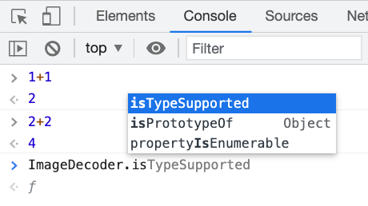
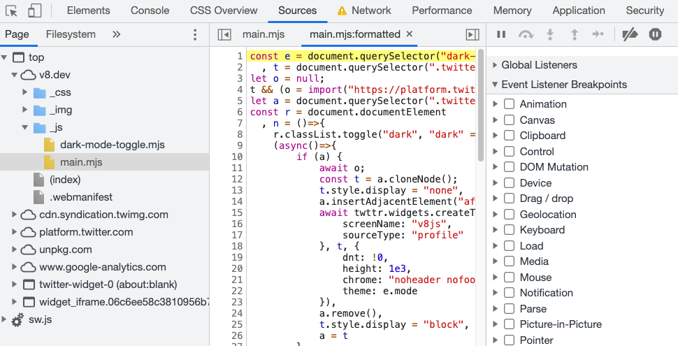
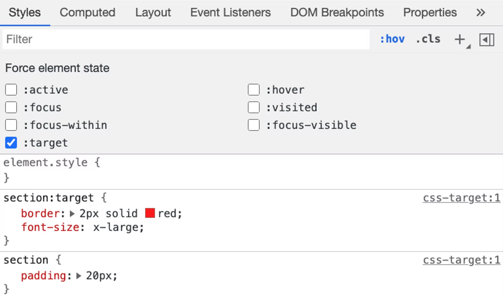
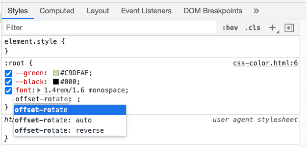
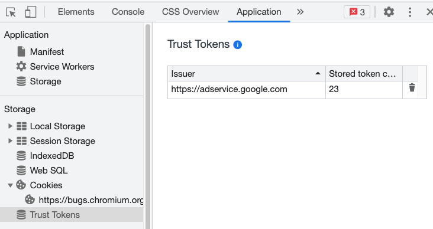
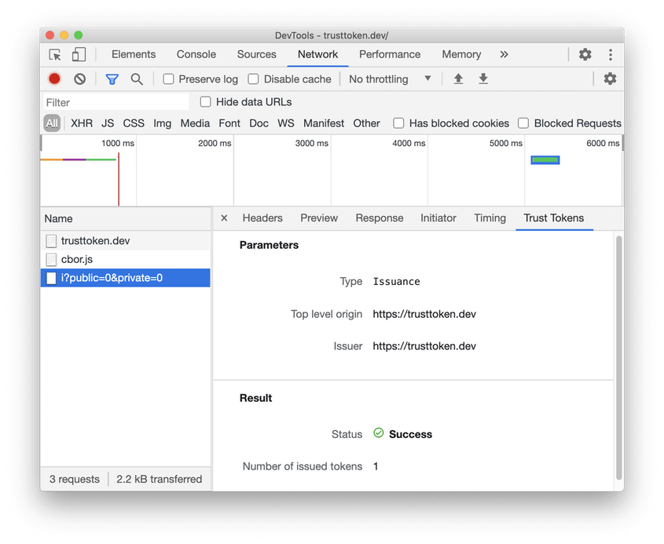

# Chromium DevTools support checklist (for Blink Intents)

[goo.gle/devtools-checklist](https://goo.gle/devtools-checklist)

**Shipping new Web Platform features (WPFs) in Chromium requires tooling support.**

Many new Web Platform Features (WPFs) can piggyback off of DevTools' general tooling for HTML, DOM, CSS, JavaScript,
WebAssembly, Network, and other aspects — requiring only minimal or no changes to make DevTools behave as expected
in light of the new WPF. This document refers to such cases as _basic tooling_.

However, some WPFs might warrant larger changes, including brand-new DevTools features. This document refers to such
cases as _extended tooling_.

It’s the WPF owner’s responsibility to ensure the tooling story is thought through, by answering the question:
_"how would a web developer making use of your new WPF test and debug their code?"_

- Basic tooling must be implemented before shipping a new WPF.
- Extended functionality must be considered on a case-by-case basis, and could in some cases be allowed to launch after shipping the WPF.

This document captures examples of different kinds of WPFs, the tooling support they require, and how this can be achieved.

*** note
**IMPORTANT:** Please take a look at the [DevTools UI feature checklist](./ui.md) prior
to changing or extending the DevTools user interface (UI).
***

[TOC]

## JavaScript (ECMAScript) language features

See the [Chromium DevTools support checklist for JavaScript language features](https://goo.gle/v8-checklist).


## WebAssembly language features

See the [Chromium DevTools checklist for WebAssembly features](https://goo.gle/devtools-wasm-checklist).


## New HTML elements

New HTML elements get basic tooling support through the DevTools Elements panel. Verify that inspecting the new element
in the Elements tab looks alright and works as expected (typically, this requires no additional implementation effort).


## New WebIDL/DOM interfaces and attributes

Verify that the new properties show up in the DevTools Console autocomplete functionality (typically, this requires no additional implementation effort).
To enable argument hints for new or changed parameterized functions, run
```
devtools-frontend/src/scripts/deps/roll_deps.py
```
to re-generate `devtools-frontend/src/front_end/models/javascript\_metadata/NativeFunctions.js` ([Example CL](http://crrev.com/c/3432787)).




## New DOM events

DevTools supports setting breakpoints on DOM events via the Sources tab → Event Listener Breakpoints. Make sure the new event is exposed under the relevant category.



Pointer: [`front_end/core/sdk/DOMDebuggerModel.ts`](https://source.chromium.org/chromium/chromium/src/+/main:third\_party/devtools-frontend/src/front_end/core/sdk/DOMDebuggerModel.ts;l=766-870;drc=79e812efee4be5e4d4378562f8acebffe9771f20)


## CSS

For CSS WPFs, basic tooling support involves the ability to view and edit styles via the DevTools Styles panel.
This mostly works out of the box, but some minimal changes might be needed depending on the specifics.

### New CSS at-rules

WPFs that introduce new CSS at-rules (i.e. `@foo (bar: baz) { … }`) must surface the new at-rules over the Chrome
DevTools Protocol (CDP) so that DevTools can show them in the Styles panel.
Please refer to [goo.gle/devtools-generic-at](https://goo.gle/devtools-generic-at) for instructions and examples on
how to add DevTools support for a new at-rule.

### New CSS pseudo-classes

WPFs that introduce a new CSS pseudo-class must surface the new pseudo-class in the Force element state UI within the Styles tab.



Example for `:target`: [Chromium back-end CL](https://chromium-review.googlesource.com/c/chromium/src/+/2575668),
[DevTools front-end CL](https://chromium-review.googlesource.com/c/devtools/devtools-frontend/+/2581544).

### New CSS properties or values

To recognize new CSS properties/values in the DevTools Styles panel’s autocomplete functionality, roll
[Chromium’s `css_properties.json5`](https://source.chromium.org/chromium/chromium/src/+/main:third\_party/blink/renderer/core/css/css_properties.json5;drc=be2c473625b9c28a4ff6735547cb0c1b6743f4ae) into the `devtools-frontend` repository by running
```
devtools-frontend/src/scripts/deps/roll_deps.py
```
see this [example CL](https://chromium-review.googlesource.com/c/devtools/devtools-frontend/+/2972583).




## Network-related features

Any WPFs that have the ability to initiate requests or otherwise involve the network stack must ensure such requests
are captured in the DevTools Network tab.

Some WPFs might warrant extended tooling, for example, [Trust Tokens](http://crbug.com/1126824) got their own tab in
DevTools’ Network panel:




## PWA features

WPFs related to Web Application Manifest, service workers, background services, notifications, storage, caching are
covered under the DevTools Application tab. Given the broad scope of features captured here, there is no generic
guidance that applies, other than: review the existing DevTools functionality related to your WPF, and ensure the
new WPF works well with it.

Depending on the WPF specifics, extended tooling might be warranted. For example, [Trust Tokens](http://crbug.com/1126824)
shipped with a new subpanel under the Application tab:



Reach out to the DevTools team via [devtools-dev@chromium.org](mailto:devtools-dev@chromium.org) prior to sending out
your Intent email.


## Warnings, deprecations, removals

If your Blink Intent is about the deprecation/removal of a WPF, or an otherwise risky change from a Web compatibility
standpoint, the basic tooling support requirement can be satisfied by integrating with DevTools’ Issues panel. See
[how to pipe your messages into the Issues tab](https://docs.google.com/document/d/13zZBu6RG7D23FSWecSy3AHPEdFHJMkp732-uJ5CFbmc)
for details.

* For issues that should be reported on the browser process, use `devtools_instrumentation::ReportBrowserInitiatedIssue()`.
  See its use sites for examples. Browser-side issues may contain information that would be unsafe for a renderer to know.
* For renderer-side issues, use `ExecutionContext::AddInspectorIssue(AuditsIssue)`. Consider adding a static method to
  `AuditsIssue` which is defined in `third_party/blink/renderer/core/inspector/inspector_audits_issue.h` that creates and
  reports the issue. `inspector_audits_issue.h` is crafted such that it minimizes dependencies (and hence can be included
  without adding too much overhead). ([Example CL](https://chromium-review.googlesource.com/c/chromium/src/+/2892206))

Try to avoid adding a new Console message — these are deprecated in favor of the Issues panel.
