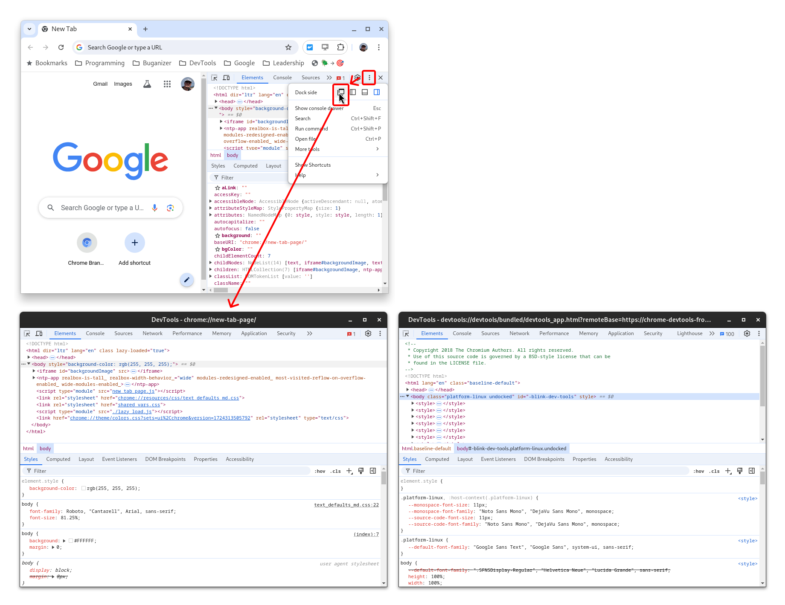
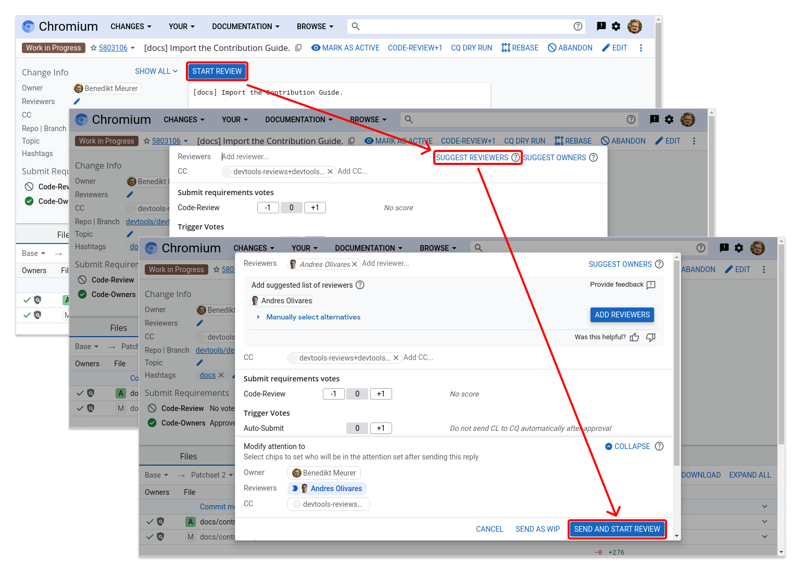

# Chromium DevTools Contribution Guide

[goo.gle/devtools-contribution-guide](https://goo.gle/devtools-contribution-guide)

This page assumes a working Chromium DevTools [checkout and build](../get_the_code.md).

1.   [Quick Start](#Quick-Start)
2.   [Design Documents](./design.md)
3.   [Contributing changes](./changes.md)
4.   [Issues Guidelines](./issues.md)
5.   [Settings, Experiments, and Features](./settings-experiments-features.md)
5.   [Legal Stuff](#Legal-Stuff)


## Quick Start

*** aside
**TL;DR**: Chrome DevTools is a web application!

It's TypeScript and CSS. It's open
source. And it's hackable. That's what this doc is about.
***

This section provides a condensed tutorial for contributing to the Chromium
developer tools front-end (for the impatient).

### Hello World

* Open DevTools to the Elements panel.
* Undock it via the 3-dots menu in the top-left.
* Make sure Elements panel is visible.
* Use the keyboard shortcut to Open DevTools (_Ctrl+Shift+I_ or _Cmd-Option-I_),
  actually DevTools-on-DevTools.



You're now inspecting the inspector! See more at the [The Hello World of Chrome
DevTools Hacking](https://medium.com/@paul_irish/1e671bf659bb) by
[paulirish@chromium.org](mailto:paulirish@chromium.org).

### How to Hack on DevTools

Read the [Get the Code](../get_the_code.md) documentation for how to setup a
working checkout and build of Chromium DevTools, and consult the [Testing
Guide](../../test/README.md) for information how to test your changes.

#### Hack on DevTools front-end

Make any changes you like in the front-end.

**Refreshing** is a little tricky when hacking on devtools. If your focus is
within the DevTools, then _Ctrl-R_ will reload the page it's inspecting. So,
that'd be fine if you _Ctrl-R_ in your DevTools-on-DevTools window.

*** note
**Tip**: _Alt-R_ or _Option+R_ will reload the DevTools instance you're focused
on.
***

**Caching**: As this is a fresh DevTools profile, the "Disable cache" checkbox
is off. You'll want to turn that on, pronto.

#### Inspector.html query parameters

There are a few query parameters worth explaining: `http://localhost:8090/front_end/inspector.html?can_dock=true&dockSide=right&ws=localhost:9222/devtools/page/1FFDE891-34F1-485C-A0CB-066EBF852E53`

* The `can_dock=true&dockSide=right` can help you emulate dock-to-right
* The `ws=…` query parameter defines the websocket connection.

#### Hacking FAQ

1.  *Why aren’t changes shown in the Sources panel when I edit the DevTools source?*

    The DevTools source files might be cached. Try checking the setting “Disable
    cache (while DevTools is open)” in DevTools' Preferences.

2.  *What about refreshing and making changes quickly?*

    For productive development, you should use `--custom-devtools-frontend` as
    listed in the [Get the code](../get_the_code.md) documentation.

3.  *Can I make a pull request?*

    Well, we don't have pull requests, but we can do something similar.
    Read about it in the [Contribution Process](#Contribution-process)

4.  *How do I change branches in git, pull changes from main, etc?*

    The [`depot_tools` tutorial](http://commondatastorage.googleapis.com/chrome-infra-docs/flat/depot\_tools/docs/html/depot_tools_tutorial.html#_creating_uploading_a_cl) is infinitely useful here.

5.  *I have more questions, and I can't find a good answer…*

    Ping the chrome devtools mailing list: [groups.google.com…google-chrome-developer-tools](https://groups.google.com/forum/?fromgroups#!forum/google-chrome-developer-tools)

6.  *I can't see my local changes in DevTools. Why?*

    * You need to reload DevTools via _Alt+R_ or _Option+R_.
    * If "Opening in existing browser session" is printed after you run the command to launch Chrome with the `--custom-devtools-frontend` argument, close the browser session in question and re-run the command.
    * (Make sure you've rebuilt the codebase after applying your changes)

### Understanding the Codebase

Make full use of chromium codesearch. [cs.chromium.org](http://cs.chromium.org) is invaluable.

* Add `f:front_end` to a search to scope it to the devtools frontend
* Add `-f:out` to exclude the minified devtools JS. Add `-f:test` to ignore various test files.

#### How DevTools Works

DevTools is a web app that talks the [DevTools Protocol](https://chromedevtools.github.io/devtools-protocol/) over a WebSocket (or an internal IPC bridge) to a [backend](https://cs.chromium.org/chromium/src/third_party/blink/renderer/core/inspector/) within Blink's C++. The [devtools-frontend/docs folder](https://github.com/ChromeDevTools/devtools-frontend/tree/main/docs) is the best current documentation on the various components of DevTools, including architecture, testing, etc

**Protocol & Backend connection**:
Read the fantastic [Contributing to Chrome DevTools Protocol](https://docs.google.com/document/d/1c-COD2kaK\_\_5iMM5SEx-PzNA7HFmgttcYfOHHX0HaOM/edit) guide, and check out the [Chrome DevTools Protocol page](https://chromedevtools.github.io/devtools-protocol/) especially *Monitoring the protocol* section.

#### How Chromium works

* [Chrome University 2018 - YouTube](https://www.youtube.com/playlist?list=PL9ioqAuyl6UIFAdsM5KU6P-hRJdh-BPmm)
* [How Blink Works](https://bit.ly/how-blink-works)

#### Compiling Chrome

Of course, you'll need the [full checkout of Chromium](https://www.chromium.org/developers/how-tos/get-the-code).

### Contribution process

This section provides a TL;DR of the contribution process, please check out the
[Contributing changes to Chromium DevTools](./changes.md) page for a more detailed
description.

#### Writing your patch

The patch process helps keep the project running smoothly. This way all efforts
are coordinated and as little effort as possible is spent in patches that won't
be accepted.

*   We need a ticket filed on [crbug.com](http://crbug.com) to keep track of the work.
    Find an existing or file a new one.
*   If you can, comment on the ticket that you'd like to work on, in case the team has
    a good reason why it hasn't been done yet.
*   Do your development.
*   Don’t worry about creating lots of small commits or writing lengthy commit messages,
    nobody will see your individual commits. All of your commits for a single patch will
    land as a single squashed commit in the repo. When you’re uploading your patch,
    you’ll have a chance to write the patch description (similar to a Pull Request
    description).
*   If you create a new file, add a license notice at the top of it:

```
// Copyright 2024 The Chromium Authors. All rights reserved.
// Use of this source code is governed by a BSD-style license that can be
// found in the LICENSE file.
```

#### Preparing your patch

If your patch is finished, we have a few helpful tools to make sure your patch looks good.

As part of the presubmit check, we will automatically run these. You can also run specific
presubmit checks by using our `npm` commands:

*   `npm run lint` to perform [ESLint](http://eslint.org) and [Stylelint](http://stylelint.io)
    checks.

To run these presubmit checks without uploading, you can run `git cl presubmit --upload`.

Read the [DevTools TypeScript Style Guide](http://goo.gle/devtools-tsstyle) for
details about the TypeScript code style.

If you are an external contributor, and it’s your first patch, you’ll need to create an
account on [chromium-review.googlesource.com](https://chromium-review.googlesource.com/dashboard/self) and make sure to add yourself to the AUTHORS file, see the section about
[Legal stuff](#Legal-stuff) for details.

#### Submitting Your Patch For Review

Once you’re done preparing your patch, it’s time to upload your changes.

*** note
**Tip:** If you need extra guidance here, try these resources:

* [Install depot tools](https://www.chromium.org/developers/how-tos/install-depot-tools)
  * [depot_tools_tutorial](https://commondatastorage.googleapis.com/chrome-infra-docs/flat/depot\_tools/docs/html/depot_tools_tutorial.html#_creating_uploading_a_cl)
  * [meowni.ca/chromium-101/#send-your-code-for-review](http://meowni.ca/posts/chromium-101/#send-your-code-for-review)
  * [developer.chrome.com/devtools/contributing-legacy#step-6-upload-your-patch](https://developer.chrome.com/devtools/docs/contributing-legacy#step-6-upload-your-patch)
***

After that, you are ready to start the patch upload:

```
# upload your patch to codereview…
git cl upload
```

*** note
**Gotcha**: If you see `git: 'cl' is not a git command`, then you need to
[add `depot_tools`](https://commondatastorage.googleapis.com/chrome-infra-docs/flat/depot_tools/docs/html/depot_tools_tutorial.html#_setting_up) repo to your `PATH`.
***

Your editor prompts you to write the patch description.

**Tips on writing a good patch description:**

* CL for DevTools can go to two different repositories:
  * If you are working on backend changes on chromium prefix your changelist (CL) title with `[DevTools]`
    * e.g.: `[DevTools] Fix DOM breakpoints sidebar pane exception`
  * For changelists (CLs) in devtools-frontend do **not** add the `[DevTools]` prefix
    * e.g. `Fix DOM breakpoints sidebar pane exception`
* Explain the change in as much detail as you like.
* When your patch is committed, the first line of the CL is used as the git commit title and the
  rest is used as the full git description.
* Try to keep your CL title and description to 80 characters per line.
* Add a `Bug: <ID>` or `Fixed: <ID>` referencing the ID of the [crbug](http://crbug.com)
  that your patch is meant for.

Save and exit the editor to finalize the patch submission.

Afterwards, you'll get the code review URL e.g.
```
remote: New Changes:
remote:   https://chromium-review.googlesource.com/#/c/chromium/src/+/90292 Fixes [WIP]
```

At this point, your patch is on the code review server, but it hasn't been sent to any
reviewers yet. You can upload WIP (work-in-progress) patches here as you develop.
Just like putting a branch on your github repo, but not submitting a PR yet.

**Adding Reviewers For Your Patch:**

Once you're ready to add a reviewer, visit that URL, confirm your patch looks how you
expect, and hit “START REVIEW“ on the top.

Don't know who should review your change? Click the “SUGGEST REVIEWERS“ button on the top
right. You need a review from the owners of the file.

In the message field, you can add PTAL (Please Take A Look) or whatever other message
you want.

*** note
**Tip**: You can find all commonly used abbreviations [here](https://www.chromium.org/glossary).
***

Now, if you're ready for it to be reviewed, click the “SEND AND START REVIEW“ button:


You will be notified by email about any new messages from the reviewers.

#### Updating Your Patch in the Review Process

If reviewers will ask you to change something in your code, follow these steps:

1. Make sure you are on your branch.
2. Run `gsync client`.
3. Optionally, pull latest changes and rebase them with: `git pull --rebase origin main`.
4. Commit locally to your branch.
5. Run the linters on your code (e.g. style, coding conventions) via `npm run lint`.
6. Finally, upload everything to the server again with `git cl upload`.
7. Once complete, add a comment similar to "comments addressed, please take a look".
   Without a comment, reviewers will not know about your new patchset.

*** note
**Tip**: Make sure you click “REPLY“ every time you’ve added a new set of inline
comments, otherwise they are in draft mode and only you can see them.
***

Once the review is given a “LGTM (Looks Good To Me) by a reviewer, you can add it
to the commit queue (CQ). To add to the commit queue, click the “SUBMIT TO CQ“
button. This will start a final run of tests and land it after a green run.

**\\o/**

#### Patch FAQ

*   *What do I do if my CL fails unrelated tests in the commit queue?*

    If the test failures look unrelated to DevTools (i.e. Blink tests),
    then try re-submitting it to the commit queue.

*   *`git cl` is saying there's no owner selected.*

    Ignore it, you'll be selecting a reviewer in the web UI.

*   *Tests?*

    You may be asked by a reviewer to write a test. If so, read
    the [Testing Guide](../../test/README.md).

*   *How do I update an existing CL with a new version of the patch?*

    When pushing an update, the system automatically remembers which remote issue
    is attached to your local branch. So nice.

*   *How do I associate my local branches to codereview URLs?*

    *   `git map-branches -vv` will show your active branches and their status.
    *   `git cl issue` will reveal the issue URL for the current branch.
    *   `git cl web` will open that URL in your browser.


## Legal stuff

All contributors must have valid Gerrit/Google accounts (which means you must
be [old enough to manage your own
account](https://support.google.com/accounts/answer/1350409)) and complete the
contributor license agreement.

For individual contributors, please complete the [Individual Contributor
License Agreement](https://cla.developers.google.com/about/google-individual?csw=1)] online. Corporate contributors must fill out the [Corporate Contributor License
Agreement](https://cla.developers.google.com/about/google-corporate?csw=1) and
send it to us as described on that page.

### First-time contributors

Add your or your organization's name and contact info to the [`AUTHORS`](./AUTHORS)
file for Chromium DevTools. Please include this as part of your first patch and
not as a separate standalone patch.

### External contributor checklist for reviewers

Before LGTMing a change from a non-`chromium.org` address, ensure that the
contribution can be accepted:

-   Definition: The "author" is the email address that owns the code review
    request on <https://chromium-review.googlesource.com>
-   Ensure the author is already listed in the [`AUTHORS`](./AUTHORS).
    In some cases, the author's company might have a wildcard rule
    (e.g. `*@google.com`).
-   If the author or their company is not listed, the CL should include a new
    [`AUTHORS`](./AUTHORS) entry.
    -    Ensure the new entry is reviewed by a reviewer who works for Google.
    -    Contributor License Agreement can be verified by Googlers at http://go/cla.
    -    If there is a corporate CLA for the author's company, it must list the
         person explicitly (or the list of authorized contributors must say
         something like "All employees"). If the author is not on their company's
         roster, do not accept the change.
