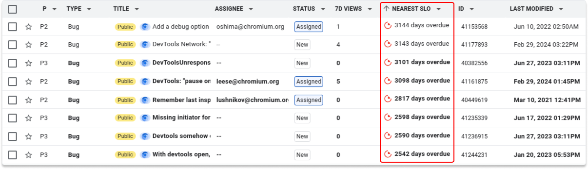

# Chromium DevTools Issues Guidelines

This document explains how Chromium DevTools (related) issues are tracked in the
`Chromium>Platform>DevTools` component tree of [crbug], how we define and manage
priorities and Service Level Objectives (SLOs), as well as the overall bug life
cycle.

[TOC]

In 2024 the Chromium project migrated [crbug] to the [Google Issue Tracker], called
[Buganizer] internally. While most of the functionality is generally available
to all Chromium contributors, some of it is limited to Googlers, and can only
be accessed via [Buganizer] internally.

## Bug reporting guidelines

The process for reporting a bug in Chromium DevTools follows the Chromium-wide
[Bug Life Cycle and Reporting Guidelines], and we encourage you to first read
through the [How to file a good browser bug] article. Proceed according to the
check list below:

1.  Try to verify that it is indeed a bug and not the intended behavior of a
    certain feature.
1.  Check if there is already a bug report for it, by searching in the list of
    [Open Chromium DevTools Bugs]. If you find an existing bug report, click
    the **+1** button in the upper-right corner of the page to indicate that
    you are also affected by this.
1.  If there's no existing bug report that matches your issue, start reporting
    a new bug.

### Report the bug

You can use the shortlink [goo.gle/devtools-bug] or the **Help > Report a
DevTools issue** menu item to start a new bug report.

You might need to login to the [Google Issue Tracker] first with a Google
account in order to proceed from there. Afterwards the **Defect from user**
template opens, where you can describe the bug. Note that the template defaults
to Markdown (with a preview below the text input box).

1.  Please enter a meaningful title.
1.  Replace `<from chrome://version/>` and `<OS version>` with the relevant
    version information.
1.  Outline exact steps to reproduce the problem. Make sure to provide steps
    that are easy and accessible. Ideally create a minified test case on
    [glitch.com](http://glitch.com) or [GitHub](http://github.com). Also
    make sure to include screenshots and videos that help us to reproduce
    and understand the problem you are facing.

## Overview

Check out the [Issues Overview] for a general introduction to the [Google Issue
Tracker]. This section provides an overview of the Chromium DevTools specifics.

### Issue types

[crbug] supports a wide range of different issue types, with ambiguous semantics.
For Chromium DevTools we explicitly limit the set of types we use and give them
well-defined semantics:

| Issue Type           | Meaning                                    |
| -------------------- | ------------------------------------------ |
| **Bug**              | The behavior does not match what is supposed to occur or what is documented. The product does not work as expected. |
| **Feature Request**  | The product works as intended but could be improved. |
| **Internal Cleanup** | This is typically a maintenance issue. The issue has no effect on the behavior of a product, but addressing it may allow more intuitive interaction. |
| **Vulnerability**    | Security vulnerabilities subject to the handling outlined in Google's [Vulnerability Priority Guidelines](http://go/vulnerability-slo). |
| **Privacy Issue**    | Privacy issues subject to the handling outlined in Google's [Privacy Issue Bugs](http://go/pib-slo). |
| **Task**             | A small unit of work.                      |
| **Project**          | A goal-driven effort with a finite start and end, focused on creating a unique product, service, or result. |
| **Feature**          | A collection of work that provides a specific value to the user. |

The first 6 (**Bug** to **Task**) are used for day-to-day work and for issues
reported by users. The last 2 (**Project** and **Feature**) are used to organize
the other types of issues for the purpose of planning (ahead). We explicitly
don't use Customer Issue, Process, Milestone, Epic, and Story within Chrome DevTools.

*** promo
**BEST PRACTICE:** Limit the nesting of **Project** and **Feature** to the bare
minimum needed, and use **Task** for small chunks of work.
***

### Parent-Child Relationships and Blocking

*** note
**TL;DR:**

-  Prefer parent-child relationships to split work into smaller chunks.
-  Prefer blocking to express dependencies between independent / adjacent
issues.
***

When splitting up work into smaller chunks or when scoping a project that
encompasses multiple bugs or feature requests, favor to express this via a
parent-child relationship. Consider the example of a CSS Nesting:

1.  This should start with an issue of type Feature which is about adding CSS
    Nesting support to Chromium DevTools.
1.  This Feature has child issues of type Task, which are concerned with adding
    CSS Nesting support to the various parts of DevTools involved, for example
    the CDP (Chrome DevTools Protocol), the Elements panel, the Sources panel,
    and so forth.
1.  Over the course of the project there'll likely also be Feature Requests and
    Bugs from internal and external developers, which should also be parented
    under the CSS Nesting Feature issue.

### Priorities

Below is a table to guide how to think about priorities, aligned with Chromium's
[Triage Best Practices]:

| Priority                                  | Timeline                       | Description                             |
| ----------------------------------------- | ------------------------------ | --------------------------------------- |
| `P0`   **(emergency)**                 | Requires immediate resolution. | Regressions which are substantially      impacting existing users, partners, or developers.   High-risk security issues affecting the stable channel.  Situations that create large, urgent, legal or financial risks for Google.
| `P1`   **(priority engineering work)** | Needed for target milestone.   | Major Regressions.   Work requiring prompt resolution. Work that has to get done before the targeted release.
| `P2`   **(active engineering  work)**  | Wanted for target milestone.   | Non-urgent issues.   Important issues that are worked on as best effort, without a milestone.  Polish or bug fixing work in areas where the team has decided we want to invest.
| `P3`   **(later, want to do)**         | Not time sensitive.            | Something we want to do, but not right now.   Legitimate issues that we will work on when we have the cycles to do so.
| `P4`   **(later, maybe never)**        | Some day... or never.          | Nice to have, but also fine not to have.

### Components

The following components in [crbug] are owned by the Chrome DevTools team.

| Component                                  | Description                                                   |
| ------------------------------------------ | ------------------------------------------------------------- |
| `Chromium>Platform>DevTools`               | Issues that don't fit any specific category                   |
| `Chromium>Platform>DevTools>Accessibility` | DevTools' accessibility                                       |
| `Chromium>Platform>DevTools>AI`            | Console Insights and Freestyler panel                         |
| `Chromium>Platform>DevTools>Animations`    | Animations panel                                              |
| `Chromium>Platform>DevTools>Application`   | Application panel                                             |
| `Chromium>Platform>DevTools>Console`       | Console panel                                                 |
| `Chromium>Platform>DevTools>Elements`      | Elements panel                                                |
| `Chromium>Platform>DevTools>Issues`        | Issues panel                                                  |
| `Chromium>Platform>DevTools>Memory`        | Heap/Memory Profiling, Memory Analysis                        |
| `Chromium>Platform>DevTools>Mobile`        | Mobile Emulation / Debugging                                  |
| `Chromium>Platform>DevTools>Network`       | Network, Network conditions,  Network request blocking panels |
| `Chromium>Platform>DevTools>Performance`   | Performance, Performance Monitor, Performance Insights panels |
| `Chromium>Platform>DevTools>Platform`      | Protocol, Backend, DevTools Extensions                        |
| `Chromium>Platform>DevTools>Recorder`      | Recorder panel                                                |
| `Chromium>Platform>DevTools>Security`      | Security panel                                                |
| `Chromium>Platform>DevTools>Sources`       | Sources panel                                                 |
| `Chromium>Platform>DevTools>UX`            | Usability and interface issues                                |
| `Chromium>Platform>DevTools>WebAssembly`   | WebAssembly issues                                            |

### Hotlists

The [Chrome DevTools TaskFlow Hotlists] bookmark group contains all the hotlists
relevant to issue management for Chromium DevTools (in particular via the Google
internal Chrome DevTools [TaskFlow]).

In particular we use the following Chromium-wide hotlists.

| Hotlist                                            | Description
| -------------------------------------------------- | -----------
| [`Chromium-Regression`](http://issues.chromium.org/hotlists/5438261) | Hotlist used to track user-noticeable regressions across Chromium.
| [`Needs-Feedback`](http://issues.chromium.org/hotlists/5433459)      | Used by the TEs and the [Triage Gardeners](triage-gardener.md) to request more feedback on an issue. The [Chrome Blintz service](http://go/chrome-blintz-user-guide) will automatically remove the label once the reporter provides more feedback.
| [`TE-NeedsTriageHelp`](http://issues.chromium.org/hotlists/5681652)  | Used by TEs when they cannot confirm a new issue and request help from the engineering team.
| [`Unconfirmed`](http://issues.chromium.org/hotlists/5437934)         | All user reported issue start their life on this hotlist. TEs do a first level triage and try to reproduce the problem, and afterwards either close the issue, or remove it from this hotlist, and therefore forward it to our [TaskFlow Inbox].
| [`User-Submitted`](http://issues.chromium.org/hotlists/5562135)      | Part of the `DevTools Issue` template, all user reported issues start life on this hotlist.

*** note
**Note**: We don't actively monitor or utilize the
[`Available`](http://issues.chromium.org/hotlists/5438642) hotlist, however,
meaning that we aren't fully aligned with the [Chromium-wide triage guidelines].
In particular, for Chromium-wide dashboards that utilize
[`Available`](http://issues.chromium.org/hotlists/5438642) as an indicator for
the triage status, Chromium DevTools might show up with a high percentage of
untriaged issues due to this fact.
***

### T-Shirt Sizes

We use the T-Shirt sizes approach to estimate effort for the `Chromium>Platform>DevTools`
component tree, based on the following guidelines:

| Size | Description                              | Examples                                                                                                                                                      |
| :--- | :--------------------------------------- | :------------------------------------------------------------------------------------------------------------------------------------------------------------ |
| XXS  | Trivial CSS or logic change              | [Styles bar loses focus in Chrome OS DevTools](http://crbug.com/338348417), [Add 20x CPU throttling preset](https://crbug.com/324978881) |
| XS   | One CL change                            | [Remove 'Consistent source map variable experiment'](http://crbug.com/40944633), [Autofill tab breaks with phone numbers starting with '+'](https://b.corp.google.com/issues/335409093) |
| S    | series of CLs or a large CL              | [Local overrides for New Tab Page misses one "/" in folder name](http://crbug.com/328210785), [Memory tool should highlight common problems and opportunities](http://crbug.com/337094903), [Improve the developer experience of using compression dictionaries](http://crbug.com/333756098) |
| M    | quarter-long single-person project       | [Exceptions in promise constructor should be treated as promise rejection](http://crbug.com/40283985) |
| L    | multi-quarter or -person project         | [Replace regex-matching in the StylesSidebarPane](http://crbug.com/40945390) |
| XL   | multi-quarter and -person project        | [MPArch migration](http://crbug.com/40238399), [GM3 adoption](http://crbug.com/40273199) |
| XXL  | multi-year project with a dedicated team | [Performance Insights](http://crbug.com/40810111) |

## SLOs

In order to deliver a better product experience for developers using Chromium
DevTools we want to

1. reduce the number of regressions that ship to the (Chrome) Stable channel, and
2. reduce the number of bugs overall.

The following SLOs (Service Level Objectives) apply to issues of type Bug,
Vulnerability, and Privacy Issue. other types of issues such as Feature Request
or Task are out of scope for SLOs (with the notable exception of Postmortem action
items, where Chrome also enforces SLOs for non-bug issues). We also explicitly
restrict these SLOs to bugs in [crbug], and are not concerned with bugs that are
tracked in other places such as GitHub. Below is a high level summary of our SLOs
(Googlers can check the [Chrome DevTools SLO Policy] and [Chrome SLO Policy] for
more details):

|      | Assignment     | Response           | Closure
| ---- | -------------- | ------------------ | --------
| `P0` | 1 business day | Every business day | 1 week
| `P1` | 1 week         | 1 week             | 4 weeks
| `P2` | 2 months       | -                  | 6 months
| `P3` | 1 year         | -                  | -

The first two rows are identical to [go/chrome-slo], with the last two rows being
specific to Chrome DevTools. [crbug] provides a **Nearest SLO** column that
surfaces SLO violations easily:

-   [SLO violations for Chrome DevTools](https://issues.chromium.org/issues?q=status:open%20componentid:1457055%2B%20type:(bug%7Cvulnerability%7Cprivacy_issue)%20nearestslo:10000d)

### Release Blocking Issues

In accordance with go/chrome-slo there are special SLOs for issues that are
severe enough to block a release shipping to users (see [go/chrome-release-slos]).
They apply to bug types in the same way as the above SLOs.

|                                                                    | Assignment | Response     | Closure
| ------------------------------------------------------------------ | ---------- | ------------ | -------
| [Urgent](http://go/chrome-release-slos#bookmark=id.2wgnoi9mltcx)   | 1 day      | Every day    | 2 days
| [Standard](http://go/chrome-release-slos#bookmark=id.bksmb4ip8mav) | 2 days     | Every 2 days | 10 days

### Email Reports

_Googlers only:_ [Buganizer] provides a nice feature that allows you to subscribe to
[Email Reports](http://go/buganizer/guides/slo-reporting#email-reports) for your
SLO (violations). Just go to **Settings** in Buganizer and enable **Subscribe to
your own reports** under **SLO Reports**.

This will get you a daily email (or whichever cadence you prefer) from Buganizer
in your Inbox that shows you up to 25 P0 and P1 out-of-SLO issues.

### Dashboard

_Googlers only:_ You can use the [Buganizer SLO Compliance] dashboard, which is
refreshed every 2-4 hours, to see SLO compliance for a given lead.

  [crbug]: https://crbug.com
  [Google Issue Tracker]: https://issuetracker.google.com/
  [Buganizer]: http://buganizer/
  [Issues Overview]: https://developers.google.com/issue-tracker/concepts/issues
  [Chrome DevTools TaskFlow Hotlists]: https://issues.chromium.org/bookmark-groups/895270
  [Chromium-wide triage guidelines]: https://www.chromium.org/for-testers/bug-reporting-guidelines/#bug-life-cycle
  [Triage Best Practices]: https://www.chromium.org/for-testers/bug-reporting-guidelines/triage-best-practices
  [Bug Life Cycle and Reporting Guidelines]: https://www.chromium.org/for-testers/bug-reporting-guidelines
  [How to file a good browser bug]: https://web.dev/articles/how-to-file-a-good-bug
  [Open Chromium DevTools Bugs]: https://issues.chromium.org/issues?q=status:open%20componentid:1457055%2B%20type:bug
  [goo.gle/devtools-bug]: https://goo.gle/devtools-bug
  [Chrome DevTools SLO Policy]: https://b.corp.google.com/slos/61348
  [Chrome SLO Policy]: https://b.corp.google.com/slos/1834
  [go/chrome-slo]: http://go/chrome-slo
  [go/chrome-release-slos]: http://go/chrome-release-slos
  [Buganizer SLO Compliance]: go/b-slo-compliance
  [TaskFlow]: http://go/chrome-devtools:taskflow
  [TaskFlow Inbox]: http://go/chrome-devtools:taskflow/inbox
