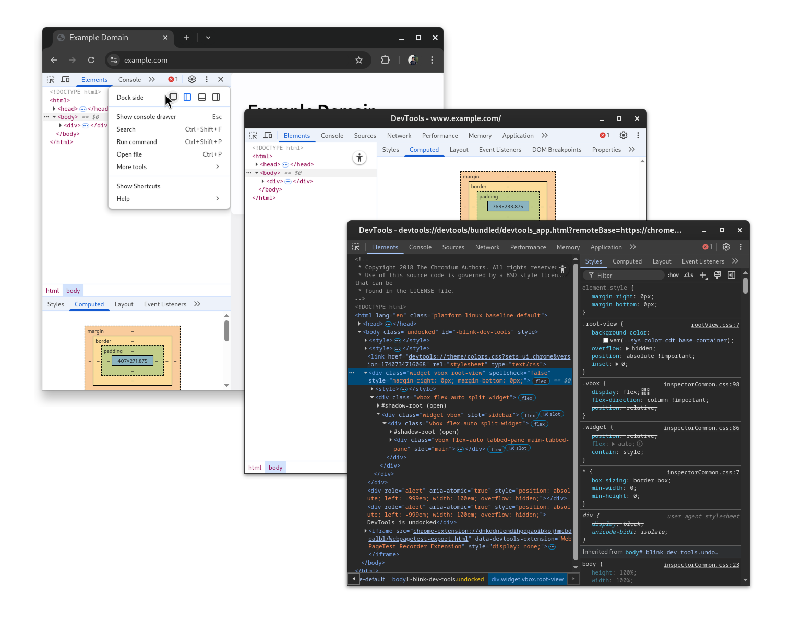
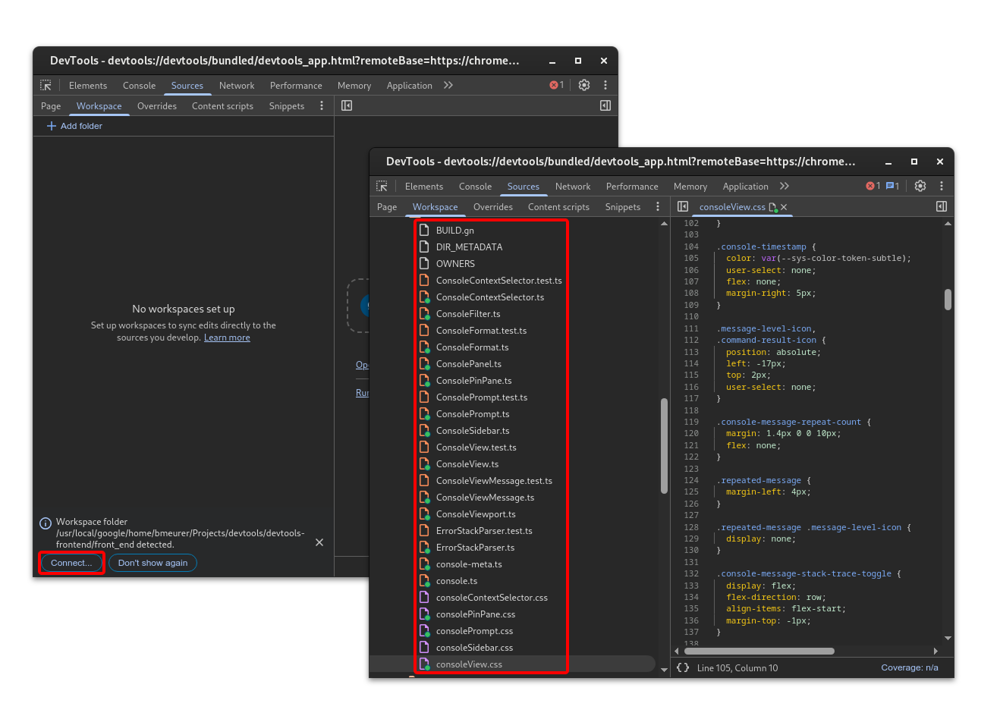

# DevTools-on-DevTools (aka Debugging the Debugger)

[goo.gle/devtools-on-devtools][self-link]

The Chromium DevTools front-end is a web application (with some special powers),
and can therefore be debugged like any other web application (using Chromium
DevTools itself).

## Inspecting the inspector

You don't need a special build of Chromium or DevTools, you can try this with
any Chrome or Chromium build. Open DevTools on any page, e.g.
`http://www.example.com`, and undock DevTools into a dedicated window.



Then in the undocked DevTools window press Cmd+Shift+I (on macOS) or
Ctrl+Shift+I (on Windows, Linux, or Chrome OS), and a new DevTools window will
open, that is debugging the actual DevTools window. You can tell them apart
based on their window titles, the original one says *"DevTools -
www.example.com"*, while the DevTools-on-DevTools says something like
*"DevTools - devtools://devtools/bundled/devtools_app.html"*.

**Pro-Tip**: Set a different color theme for the DevTools-on-DevTools to be able
to tell them apart more easily. For example, use light theme for actual DevTools
and dark theme for DevTools-on-DevTools.

When using `--custom-devtools-frontend`, you can also right-click anywhere in
the regular DevTools and select *Inspect* from the context menu to open a
DevTools-on-DevTools window, even when the regular DevTools window is docked.

## Using Automatic Workspace folders

The [Workspace][workspace-documentation] feature is a powerful tool for working
on DevTools, as it allows you preview changes to styles instantly, even while
editing in your IDE (e.g. VS Code or Cider-G). With M-135, a new feature called
[Automatic Workspace folders][automatic-workspace-folders-documentation] was
introduced, which can be used to make debugging and developing DevTools easier.

As of 2025-03-16, the feature is enabled by default in M-136 and later version.
Follow the steps [here](../ecosystem/automatic_workspace_folders.md#setup) to
set up your Chrome or Chromium instance for earlier versions of M-136 and M-135.

Then in your `devtools-frontend` checkout, use

```
./third_party/chrome/chrome-linux/chrome \
   --disable-infobars \
   --custom-devtools-frontend=file://$(realpath out/Default/gen/front_end)
```

on Linux or

```
./third_party/chrome/chrome-mac/Google\ Chrome\ for\ Testing.app/Contents/MacOS/Google\ Chrome\ for\ Testing \
  --disable-infobars \
  --disable-features=MediaRouter \
  --custom-devtools-frontend=file://$(realpath out/Default/gen/front_end) \
  --use-mock-keychain
```

on macOS to start. The first time you do this, you'll need to connect the folder
to your workspace.



Afterwards you can immediately access the DevTools source code from within your
DevTools-on-DevTools, and for example work on CSS changes in real time, without
having to worry about extracting them out of DevTools-on-DevTools later. This
even works from within your IDE or editor: As long as the (automatic) workspace
folder is connected and DevTools-on-DevTools is open, it'll listen for changes
to these files on disk, and automatically pick up any CSS changes and apply
them.

[self-link]: http://goo.gle/devtools-on-devtools
[workspace-documentation]: https://developer.chrome.com/docs/devtools/workspaces
[automatic-workspace-folders-documentation]: http://goo.gle/devtools-automatic-workspace-folders
