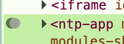

# Requirements Specification: Elements Panel Gutter & Decoration Logic

## 1. Overview
The gutter area in the Elements panel DOM tree serves as a visual indicator for state markers (decorations) associated with DOM nodes. These decorations provide users with "at-a-glance" information about the node or its subtree, such as active breakpoints or framework-specific annotations.

## 2. Functional Requirements

### 2.1 Decoration Visibility
*   **Target Nodes**: Decorations must only appear on **Element** nodes (e.g., `
`, `<body>`). They must not appear on text nodes or closing tags.
*   **Visual Indicators**: Active states must be represented by colored markers (dots) within the gutter to the left of the element's tag.
*   **Multiple States**: If a node has multiple active states (e.g., multiple types of breakpoints), the gutter must display markers for all of them.
    *   **Layout**: Markers must be arranged horizontally.
    *   **Spacing**: Markers must be tightly packed, with each subsequent marker offset by exactly `3px` to the right of the previous one (creating a stacked or dense visual line).
    

### 2.2 Parent/Child Aggregation Logic
The visibility of decorations depends on the expansion state of the node to ensure users don't miss information hidden inside collapsed regions.

*   **Collapsed State (Summary View)**:
    *   The gutter must display markers for the node's **own** decorations.
    *   The gutter must **also** display markers for any **descendant** nodes that have decorations. This acts as a summary, alerting the user that a reflected state exists somewhere inside the collapsed subtree.
*   **Expanded State (Direct View)**:
    *   The gutter must **only** display markers for the node's **own** decorations.
    *   Markers for descendant nodes must be hidden from the parent's gutter, as they will be directly visible on the child nodes themselves.
    *   **Style**: Descendant markers visible in the collapsed state must be rendered with `50%` opacity to visually distinguish them from the node's own decorations.

### 2.3 Tooltip Behavior
Hovering over the decoration markers in the gutter must display a consolidated tooltip containing:
*   **Own Decorations**: A list of titles for all decorations active on the current node.
*   **Descendant Decorations** (Collapsed State Only): A separate list of titles for decorations found within the subtree, clearly labeled to distinguish them from the parent's own states (e.g., under a "Children:" header).

### 2.4 Layout & Positioning
*   **Indentation Tracking**: The decoration container must dynamically adjust its position to match the indentation level of the tree element. It should always appear to the left of the opening tag, regardless of how deep the node is in the DOM hierarchy.
*   **Gutter Alignment**: The markers must align consistent with the "gutter" column effectively creating a vertical channel for status indicators down the left side of the tree.

### 2.5 User Interaction
*   **Menu Access**: Clicking on the gutter area (often visualized with a "..." icon or actionable space) must trigger the context menu for that node, allowing access to actions related to the decorations (e.g., removing a breakpoint).

### 2.6 Performance
*   **Throttled Updates**: Changes to decorations must be batched or throttled. Visually updating the markers should not occur synchronously with every minor internal state change to prevent UI flickering during rapid DOM updates.
