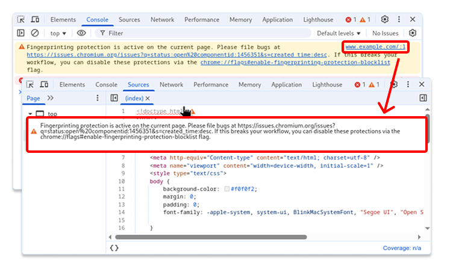
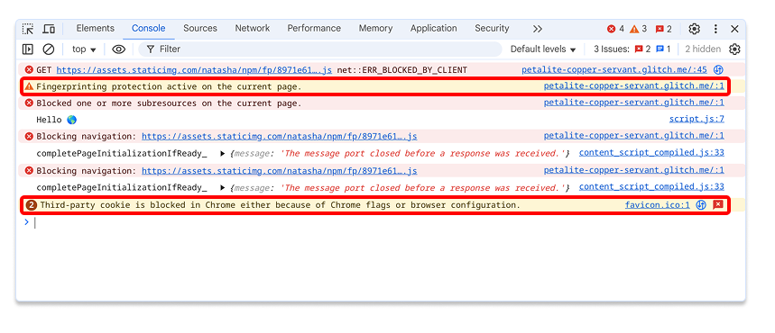
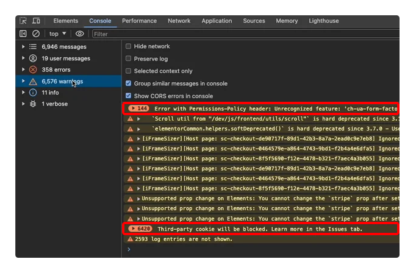

# Chromium DevTools Console Policy

[goo.gle/devtools-console-policy](http://goo.gle/devtools-console-policy)
([go/chrome-devtools:console-policy](http://go/chrome-devtools:console-policy))

**TL;DR:** This policy outlines a strategy to keep the signal to noise ratio in
the Console panel of Chromium DevTools high, by setting clear expectations for
Chromium teams what kind of information is presented to web developers via the
Console and how it is presented. Console spam, specifically from Chromium
itself, is a known pain point for developers (e.g.
[crbug/338403584](http://crbug.com/338403584)).

## Background

The [Console panel](https://developer.chrome.com/docs/devtools/console) in the
Chromium Developer Tools is usually the first place where web developers check
in case something is not working as expected, and ideally they would come across
an error or warning message here that helps them to quickly resolve the issue at
hand. The panel shows all the messages that are logged by the web application
but also the browser (potentially on behalf of the web application, for example
logging uncaught exceptions).

In order for it to remain useful to web developers, the signal to noise ratio
must be as high as possible, and it’s crucially important to keep in mind that
the information shown is (a) relevant to what the developer is looking for right
now and (b) actionable wrt. to the issue at hand. Putting it the other way
around, while the developer is focused on investigating a concrete problem it
doesn’t help to show a lot of messages around potential issues, suggested
improvements, or things that went wrong without any useful breadcrumbs (prime
examples here are error messages from somewhere deep in Blink which contain no
stack traces and basically just repeat the information that is already present
on a JavaScript exception throw at the same time).

## Common problems

### Useless anchor

A common problem we’ve observed is console messages from Chromium without a
meaningful and actionable stack trace. Consider the following example, where the
location attached to the console message is the first line of the main document.
The inexperienced web developer will probably be puzzled how come
`<!doctype html>` activates fingerprinting protection on the current page.

### For your information

From a Chromium team working on a specific feature, it might be totally
reasonable to _”let the developer know what’s going on”_, because something
could break. But from a user’s perspective, messages that basically only convey
non-actionable information and aren’t relevant in the context of the problem
that the developer is investigating are useless at best. Consider the following
example:

The first warning message says that Fingerprinting protection is active, but
doesn’t tell the developer whether that’s a problem or not, and what they can do
about it. It’s highly confusing. The second warning message states that two
third-party cookies were blocked, but also leaves the developer wondering if
that’s something to be concerned about or caused any actual problem.

Similar messages that fall into this bucket:

* `Third-party cookie will be blocked. Learn more in the Issues tab`
* `[Violation] 'setTimeout' handler took <N>ms`
* `[Violation] Added non-passive event listener to a scroll-blocking <some> event. Consider marking event handler as 'passive' to make the page more responsive. See <URL>`
* `Specifying 'overflow: visible' on img, video and canvas tags may cause them to produce visual content outside of the element bounds. See https://github.com/WICG/view-transitions/blob/main/debugging_overflow_on_images.md for details.`

Logging a message to the Console panel just to tell the developer to open
another panel or read some article is specifically annoying, and over time will
result in training web developers on ignoring messages produced by Chromium
itself.

### Repetition

Repeating the same message over and over again (independent of whether it’s
actionable and meaningful) is another source of problems:

DevTools has a feature to group similar messages, which most users have enabled,
so the pain they feel from a lot of repeated information is manageable. But that
also gives rise to a new problem: Problems might be hidden through the grouping
feature outside of the viewport, because the grouping somewhat breaks the
chronological order.

## Best practice

Specifically for the purpose of being able to present developers with actionable
information, coupled with traces of data that are relevant to the issue, we’ve
introduced the [Issues panel], and as part of
[crbug/40173406](http://crbug.com/40173406) and related bugs already migrated a
few spammy console messages to issues.

In general, reserve the use of `context->AddConsoleMessage(...)` and similar
APIs for rare cases when the console message adds significant value, favor a
well-worded and helpful issue over a console message, and specifically don’t
spit out a console message when you are already raising an exception (exceptions
can be coupled with issues internally to provide more actionable information).

## Building empathy

Many Chromies might not be able to immediately relate to the struggles of web
developers, and might not have first hand experience with sifting through
endless logs of useless information produced by frameworks, libraries, and
eventually the browser. But imagine the following scenario: You are using `gdb`
or `lldb` and instead of helping you diagnose the crash somewhere deep in your
C++ code for Autofill in the browser process, it’s spamming you with pages of
potential performance improvements in the renderer code for `<canvas>` elements.
At best that would be very confusing, but more likely you’d be very frustrated
with the tool after a while. This is exactly what happens if we spam web
developers with potential performance issues.

We have a [logging policy for Chromium] to prevent ourselves from being
overwhelmed by log messages from other Chromium teams, for the same reason.

## GTM strategy

The most common cause for spammy console messages from Chromium is an
insufficient Go-To-Market (GTM) strategy for features or (potentially breaking)
changes when it comes to developer adoption. Oftentimes it’s unclear what
exactly the expectations are and what are the critical user journeys that web
developers go through. Spending a bit more time on this aspect and involving
DevRel early on can help to shine light on the matter and avoid sprinkling log
messages all over the place to _”raise awareness”_. Specifically consider:

- The precise target audience for your information, because not all web
  developers are equal at all times.
- Under which exact circumstances that piece of information is required.
- Is it a nice to have (e.g. _”X could be faster if you did Y”_ or _”using A
  poses a potential security risk for your users”_) or a critically important
  piece of information (e.g. _”X will stop working in the next release unless
  you do Y”_).

Feel free to reach out to [devtools-dev@chromium.org] with questions, and ping
[dsv@chromium.org](mailto:dsv@chromium.org) (Chrome DevTools TL) or
[hablich@chromium.org](mailto:hablich@chromium.org) (Chrome DevTools PM)
directly (specifically in case of code reviews which add new problematic console
messages).

  [Issues panel]: https://developer.chrome.com/docs/devtools/issues
  [logging policy for Chromium]: https://chromium.googlesource.com/chromium/src/+/main/styleguide/c++/c++.md#logging
  [devtools-dev@chromium.org]: https://groups.google.com/a/chromium.org/g/devtools-dev
