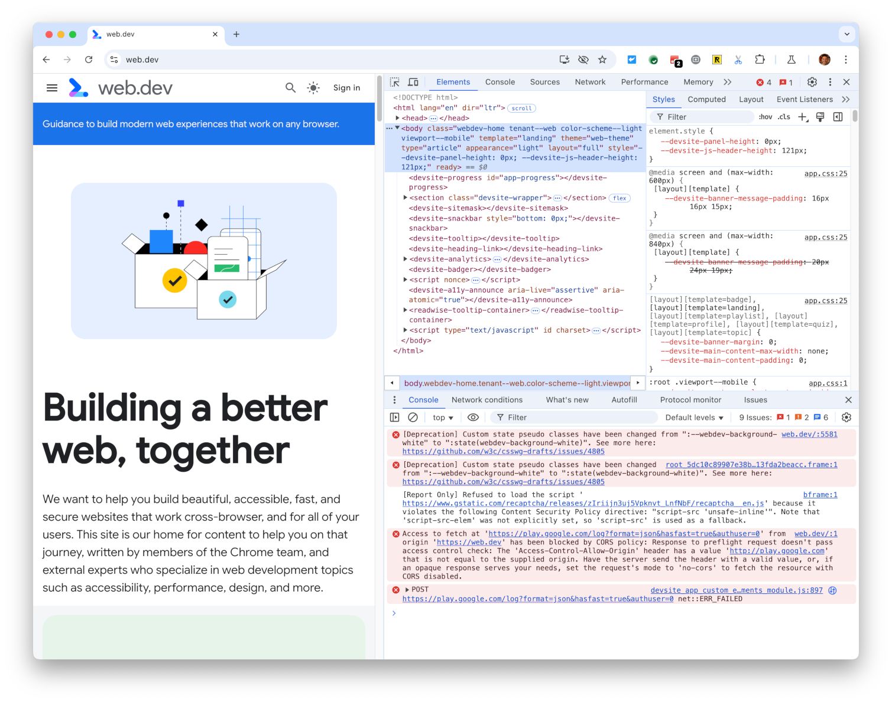
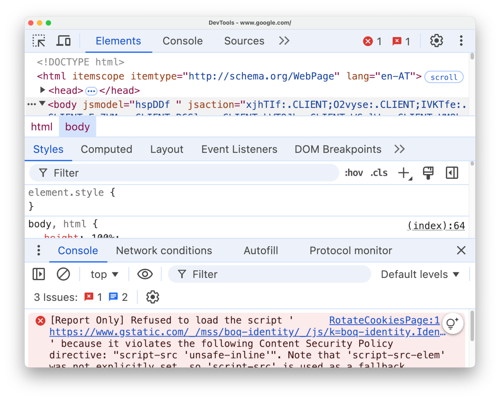
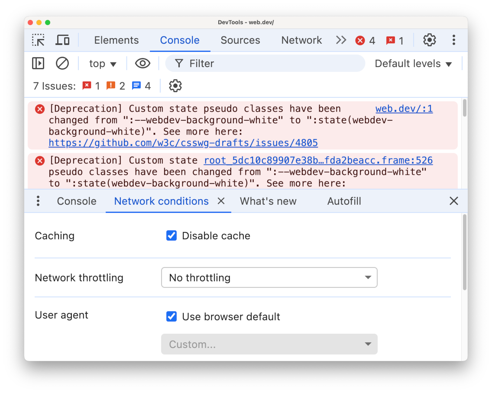

# DevTools Page Zoom Accessibility Policy

Chrome DevTools needs to fulfill the Google Accessibility Rating (GAR) criteria.

GAR Web’s page zoom criteria state: “Confirm the application is also usable […]
with page zoom enabled by 200% at a browser resolution of 1024x768 pixels. This
width is the equivalent to resizing a browser window to 512 pixels…”

It is unclear what exactly this means for DevTools: DevTools can be opened as
part of the main Chrome window (docked view) or as a separate standalone window
(undocked view). In both cases the overall DevTools window/panel is resizable,
and it contains sub-panels which are themselves resizable.

Docked DevTools, with top and bottom panel, top panel split vertically:  
  

Undocked DevTools, zoom factor 200%, with top and bottom panel, top panel
split horizontally:  
  

As can be seen in the second screenshot above, with multiple panels open at the
same time, there is not much space left for each panel.

Because of the panels’ resizability, we need to establish minimum panel sizes
for GAR zoom testing. We have therefore agreed on the following criteria for
a11y testing of DevTools with Page Zoom:

* DevTools should be opened in a separate window (=undocked view), with a
  resolution of 1024x768 pixels and a zoom factor of 200%.
* When testing a panel in the top drawer (Elements panel, Network panel,
  Performance panel,…), the whole 1024x768 pixel window should be available for
  the panel. Bottom drawer panels should be closed by pressing ‘Esc’.
* When testing a panel in the bottom drawer, the panel should not be smaller
  than half the size of the overall DevTools window (i.e. a height of 384 pixels
  at 200% zoom).

Undocked DevTools, 1024x768 pixels, zoom factor 200%, ready for page zoom a11y
testing of the bottom panel:  
  

## References

[Supported viewport sizes and zoom levels in Chrome DevTools](https://goo.gle/smoldevtools)
