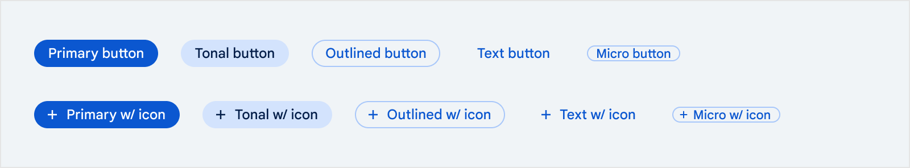
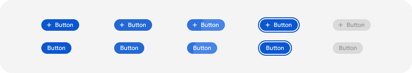
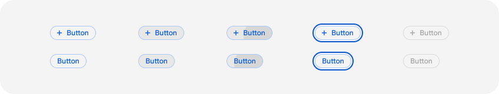
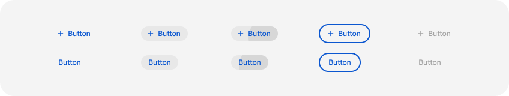
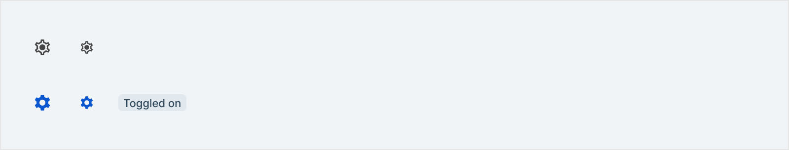
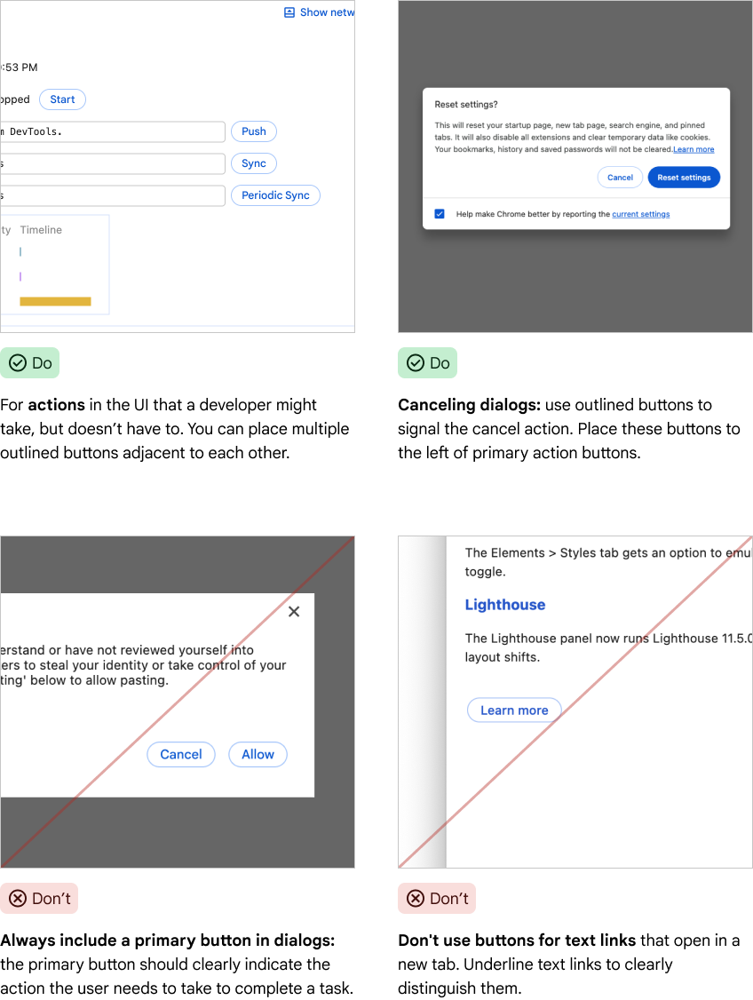
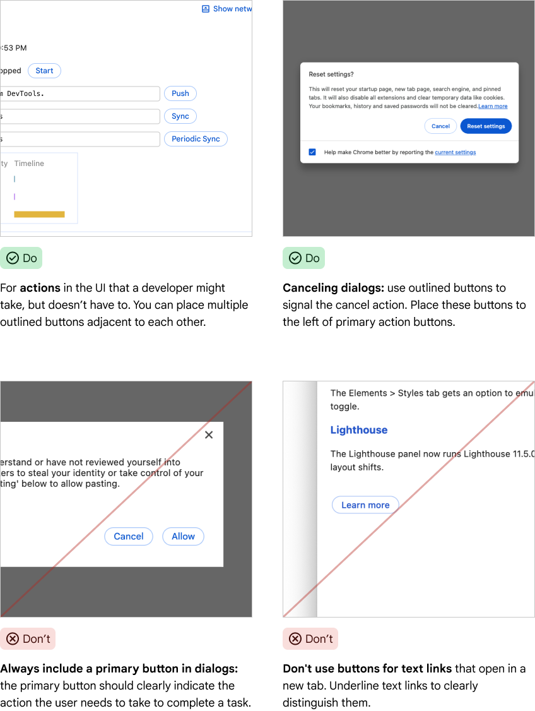
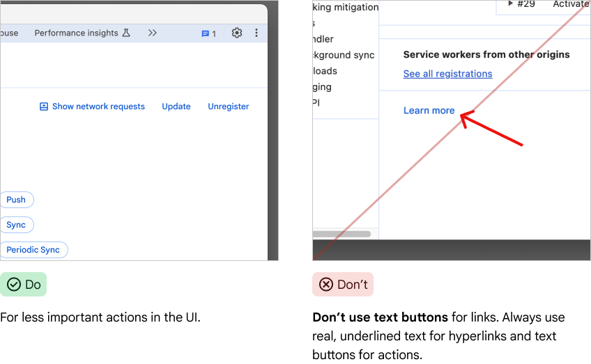
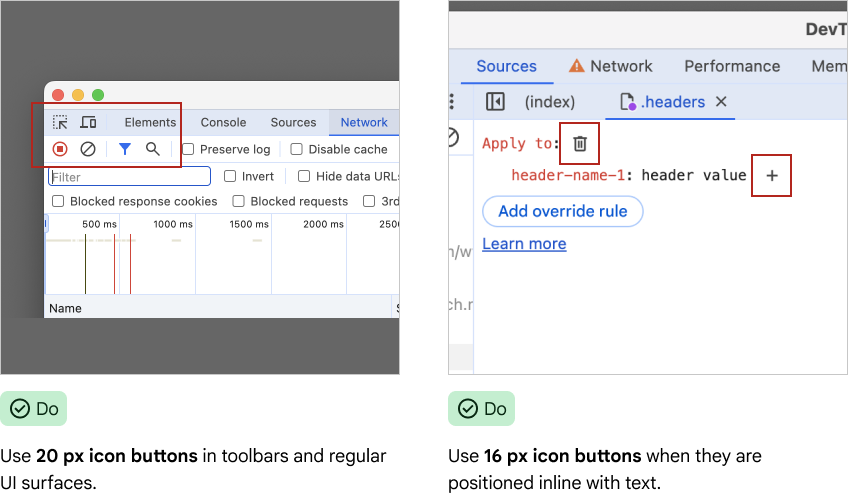

# Components

[TOC]

## Buttons



### Variations

#### Primary buttons



Primary buttons are the most prominent type of button available. They are used
for a single, necessary action a developer must complete, or for a highly
recommended, promoted action. Use them sparingly and with purpose.

#### Tonal buttons



Use tonal buttons in dialogs for actions that stand secondary to a primary
action and are not a cancel or close action.

#### Outlined buttons


Outlined buttons are the default button style. Use them for regular actions in
the UI or to cancel dialogs.

#### Text buttons



Text buttons are the least prominent button choice. Use them in cases outlined
buttons would create too much visual noise.

#### Micro buttons

Micro buttons are used if we have a small line height.

#### Icon buttons



Use icon buttons in toolbars of contextual actions that shouldn’t take up much
space.

### Usage

#### Developer guidelines

##### Dos and Don'ts

###### Do

  * Use
    [`devtools-button`](https://source.chromium.org/chromium/chromium/src/+/main:third_party/devtools-frontend/src/front_end/ui/components/buttons/Button.ts)
    for Primary, Outlined, Text, Micro and Icon buttons
  * Use
    [`ToolbarButton`](https://source.chromium.org/chromium/chromium/src/+/main:third_party/devtools-frontend/src/front_end/ui/legacy/Toolbar.ts;drc=2017cd8a8925f180257662f78eaf9eb93e8e394d;bpv=1;bpt=1;l=555?q=toolbar.ts%20devtools&ss=chromium&gsn=ToolbarButton&gs=KYTHE%3A%2F%2Fkythe%3A%2F%2Fchromium.googlesource.com%2Fcodesearch%2Fchromium%2Fsrc%2F%2Fmain%3Flang%3Dtypescript%3Fpath%3Dfront_end%2Fui%2Flegacy%2FToolbar%23ToolbarButton%2523type)
    for buttons inside
    [`Toolbars`](https://source.chromium.org/chromium/chromium/src/+/main:third_party/devtools-frontend/src/front_end/ui/legacy/Toolbar.ts).
    Underneath they make use of `devtools-button`.

###### Don'ts

  * Use `<button>`, as they are not styled correctly
  * Change the default color of icons (only in exceptions)

##### Developer examples

###### Primary button

Usage within HTML environment:

```html
<devtools-button
      class="some-class"
      .variant=${Buttons.Button.Variant.PRIMARY}
                 .title=${i18nString(UIStrings.someString)}
      .jslogContext=${'some-context')
      @click=${handleClick()}
      )></devtools-button>
```

Usage within Typescript environment (mostly when working with legacy code):

```ts
  const button = new Buttons.Button.Button();
  button.data = {
      variant: Buttons.Button.Variant.PRIMARY,
      title: i18nString(UIStrings.someString),
      jslogContext: 'some-context',
    };
  button.classList.add(‘some-class’);
  button.addEventListener(‘click’, () => handleClick());

```

#### Design guidelines

##### Dos and Don'ts

###### Primary Buttons


###### Tonal buttons



#### Outlined buttons



#### Text buttons



#### Icon buttons



### Resources

#### For developers

##### Implementation

  * [`devtools-button`](https://source.chromium.org/chromium/chromium/src/+/main:third_party/devtools-frontend/src/front_end/ui/components/buttons/Button.ts)

#### For designers

##### Figma

  * [Buttons](https://www.figma.com/design/A5iQBBNAe5zPFpJvUzUgW8/CDT-design-kit?node-id=481-2167&m=dev)
  * [Icon
    buttons](https://www.figma.com/design/A5iQBBNAe5zPFpJvUzUgW8/CDT-design-kit?node-id=571-616&m=dev)
