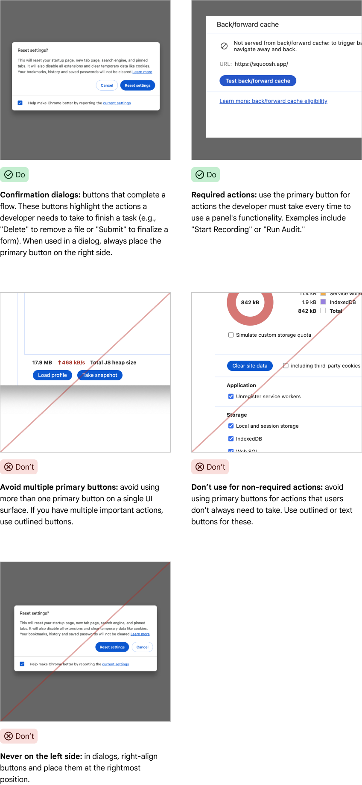

# Components

[TOC]

## Buttons


### Variations

#### Primary buttons


Primary buttons are the most prominent type of button available. They are used
for a single, necessary action a developer must complete, or for a highly
recommended, promoted action. Use them sparingly and with purpose.

#### Tonal buttons


Use tonal buttons in dialogs for actions that stand secondary to a primary
action and are not a cancel or close action.

#### Outlined buttons


Outlined buttons are the default button style. Use them for regular actions in
the UI or to cancel dialogs.

#### Text buttons


Text buttons are the least prominent button choice. Use them in cases outlined
buttons would create too much visual noise.

#### Micro buttons

Micro buttons are used if we have a small line height.

#### Icon buttons


Use icon buttons in toolbars of contextual actions that shouldn’t take up much
space.

### Usage

#### Developer guidelines

##### Dos and Don'ts

###### Do

  * Use
    [`devtools-button`](https://source.chromium.org/chromium/chromium/src/+/main:third_party/devtools-frontend/src/front_end/ui/components/buttons/Button.ts)
    for Primary, Outlined, Text, Micro and Icon buttons
  * Use
    [`ToolbarButton`](https://source.chromium.org/chromium/chromium/src/+/main:third_party/devtools-frontend/src/front_end/ui/legacy/Toolbar.ts;drc=2017cd8a8925f180257662f78eaf9eb93e8e394d;bpv=1;bpt=1;l=555?q=toolbar.ts%20devtools&ss=chromium&gsn=ToolbarButton&gs=KYTHE%3A%2F%2Fkythe%3A%2F%2Fchromium.googlesource.com%2Fcodesearch%2Fchromium%2Fsrc%2F%2Fmain%3Flang%3Dtypescript%3Fpath%3Dfront_end%2Fui%2Flegacy%2FToolbar%23ToolbarButton%2523type)
    for buttons inside
    [`Toolbars`](https://source.chromium.org/chromium/chromium/src/+/main:third_party/devtools-frontend/src/front_end/ui/legacy/Toolbar.ts).
    Underneath they make use of `devtools-button`.

###### Don't

  * Use `<button>`, as they are not styled correctly
  * Change the default color of icons (only in exceptions)

##### Developer examples

###### Primary button

Usage with lit-html:

```js
html`<devtools-button class="some-class"
                      .variant=${Buttons.Button.Variant.PRIMARY}
                      .title=${i18nString(UIStrings.someString)}
                      .jslogContext=${'some-context')}
                      @click=${onClick})></devtools-button>`
```

Usage with the imperative API:

```js
const button = new Buttons.Button.Button();
button.data = {
    variant: Buttons.Button.Variant.PRIMARY,
    title: i18nString(UIStrings.someString),
    jslogContext: 'some-context',
  };
button.classList.add('some-class');
button.addEventListener('click', event => onClick(event));
```

#### Design guidelines

##### Dos and Don'ts

###### Primary Buttons



###### Tonal buttons


#### Outlined buttons


#### Text buttons


#### Icon buttons


### Resources

#### For developers

##### Implementation

  * [`devtools-button`](https://source.chromium.org/chromium/chromium/src/+/main:third_party/devtools-frontend/src/front_end/ui/components/buttons/Button.ts)

#### For designers

##### Figma

  * [Buttons](https://www.figma.com/design/A5iQBBNAe5zPFpJvUzUgW8/CDT-design-kit?node-id=481-2167&m=dev)
  * [Icon
    buttons](https://www.figma.com/design/A5iQBBNAe5zPFpJvUzUgW8/CDT-design-kit?node-id=571-616&m=dev)

## Combo Boxes and Single Select menus


### Usage

#### Developer guidelines

##### Dos and Don'ts

###### Do

  * Use [`<select>`](https://developer.mozilla.org/en-US/docs/Web/HTML/Element/select)
    with [`<option>`](https://developer.mozilla.org/en-US/docs/Web/HTML/Element/option)
    and [`<optgroup>`](https://developer.mozilla.org/en-US/docs/Web/HTML/Element/optgroup)
    if necessary, together with core styles.
  * Override inherited `width` with CSS if necessary.

###### Don't

  * Override the default colors.
  * Introduce custom select components.

##### Developer examples

Usage with lit-html:

```js
html`<select aria-label="Choose your champion"
             @onchange=${onChange}>
  <option hidden value="Choose your champion"></option>
  <option jslog=${VisualLogging.item('hamster').track({click: true})}
          value="Hamster">Hamster</option>
  <option jslog=${VisualLogging.item('mouse').track({click: true})}
          value="Mouse">Mouse</option>
  <option jslog=${VisualLogging.item('cat').track({click: true})}
          value="Cat">Cat</option>
</select>`
```

Usage with the imperative API:

```js
const select = UI.UIUtils.createSelect('Choose your champion', [
  'Hamster',
  'Mouse',
  'Cat',
]);
select.addEventListener('change', event => onChange(event))
```

## Radio Buttons


### Usage

#### Developer guidelines

##### Dos and Don'ts

###### Do

  * Use [`<input type="radio">`](https://developer.mozilla.org/en-US/docs/Web/HTML/Element/input/radio)
    nested within a [`<label>`](https://developer.mozilla.org/en-US/docs/Web/HTML/Element/label)
    for radio buttons, together with core styles.

###### Don't

  * Override the default colors.

##### Developer examples

Usage with lit-html:

```js
const jslog = VisualLogging.toggle().track({change: true}).context(jslogContext);
html`<label><input type="radio" name=${name} jslog=${jslog}>${title}</label>`
```

Usage with the imperative API:

```js
const {label, radio} = UI.UIUtils.createRadioButton(name, title, jslogContext);
radio.addEventListener('change', event => onChange(event))
```

## Sliders


### Usage

#### Developer guidelines

##### Dos and Don'ts

###### Do

  * Use [`<input type="range">`](https://developer.mozilla.org/en-US/docs/Web/HTML/Element/input/range)
    for sliders, together with core styles.

###### Don't

  * Override the default colors.

##### Developer examples

Usage with lit-html:

```js
html`<input type="range"
            min=${min}
            max=${max}
            tabindex=${tabIndex}
            @change=${onChange}>`
```

Usage with the imperative API:

```js
const slider = UI.UIUtils.createSlider(min, max, tabIndex);
slider.addEventListener('change', event => onChange(event))
```

## Icons


### Usage

#### Design guidelines

Find an exhaustive collection of icons currently used in DevTools [here](https://drive.google.com/corp/drive/folders/1EpmxLRjvdHn5Ia8iT3aicgIEPEvhXY_D?resourcekey=0-QseNsNRsF4w8F5EKz7ncnA)

#### Developer guidelines

For some frequently used icons e.g. cross-circle, warning-filled etc. colors are auto-set in the component. See full list [here](https://source.chromium.org/chromium/chromium/src/+/main:third_party/devtools-frontend/src/front_end/ui/components/icon_button/icon.css;l=47)

##### Dos and Don'ts

###### Do

  * Set class and change color in .css files
  * Set one of the predefined classes to change icon size e.g. extra-small for 12px

###### Don't

  * Use icons as buttons
  * Use Icon constructor and data setter (deprecated)
  * Use inline styles e.g. `js icon.style.color = ‘some-color’`

##### Developer examples

Usage with lit-html:

```js
html`<devtools-icon name=${'some-icon-name'}></devtools-icon>`
```

Usage with the imperative API:

```js
const someIcon = IconButton.Icon.create('some-icon-name', 'some-class');
```

## Context menus


Context Menu allows us to display contextual actions to the user, typically triggered by a right-click or via a dedicated menu button.

### General information

#### ContextMenu Class

The primary class for creating and managing context menus.
It can render as a "soft" menu (custom HTML-based implementation, offering extra functionality like keeping the menu open) or a native menu. The preferred and default way is the native menu, soft menu should ONLY be used in exceptional cases where native menu lacks features.
Typically instantiated in response to a user event (e.g. contextmenu mouse event).

#### Item Class

Represents an individual entry within a context menu.
Types:
  * 'item': A standard clickable menu item.
  * 'checkbox': An item that can be toggled on or off.
  * 'separator': A visual line to group related items.
Items can have labels, handlers, be enabled/disabled. Optionally can also display shortcuts or tooltips (both are exceptions and not recommended).

#### Section Class

Groups related Items within a ContextMenu or SubMenu.
Helps organize the menu structure and often introduces visual separation.
Predefined section names (e.g. 'header', 'clipboard', 'default', 'footer') are available on ContextMenu and SubMenu instances.

#### SubMenu Class

A special type of Item that, when clicked or hovered, opens another nested menu.
SubMenus contain their own Sections and Items, allowing for hierarchical menu structures.

#### MenuButton Component

A custom HTML element (`<devtools-menu-button>`) that renders as a button (currently an icon button only, though we plan to extend it to text buttons too).
When clicked, it instantiates and displays a ContextMenu.
Configured via HTML attributes (e.g. `icon-name`, `title`) and a `populateMenuCall` property to define the menu's content.


#### Providers

A mechanism to dynamically add context-specific menu items.
Providers are registered with `ContextMenu.registerProvider()` and are associated with specific object types.
When a context menu is shown for a particular target object, relevant providers are invoked to append their items.


#### Registered Items

A way to add menu items (linked to actions from the `ActionRegistry`) to predefined locations within the DevTools UI (e.g. the main menu, navigator context menus).
Items are registered using `ContextMenu.registerItem()` with a specific `ItemLocation`.

### Usage

#### Design Guidelines

Generally, we do not recommend using shortcuts in context menus since this goes against Mac platform guidelines and we do not want to have them on some platforms, but not the others. Try to find an alternative solution, however if none is possible and showing shortcuts is critical for a smooth user flow, reach out to kimanh@ or kprokopenko@.

#### Developer guidelines

##### Dos and Don'ts

###### Do

  * Use `new ContextMenu(event, options?)` to create and show menus in response to user interactions (e.g. contextmenu event on an element).
  * Use `<devtools-menu-button>` to create buttons that should trigger a context menu.

###### Don't

  * Forget to call `contextMenu.show()` after populating the menu; otherwise, it won't open.

##### Developer examples

Usage with lit-html (left-click on a `<devtools-menu-button>` opens a menu):

```js
html`
<devtools-menu-button
  icon-name="some-icon-name"
  .populateMenuCall=${(menu: UI.ContextMenu.ContextMenu) => {
    menu.defaultSection().appendItem('Item', () => {
      console.log('Item clicked');
    }, {jslogContext: 'item'});
  }}
  jslogContext="my-menu-button"
></devtools-menu-button>
`
```

Usage with the imperative API (menu shows on a right-click)

Various simple menu items:

```js
const element = this.shadowRoot.querySelector('.element-to-add-menu-to');
element.addEventListener('contextmenu', (event: MouseEvent) => {
  const contextMenu = new UI.ContextMenu.ContextMenu(event);

// Regular item
  contextMenu.defaultSection().appendItem('Regular item', () => {
    console.log('Regular item clicked ');
  }, { jslogContext: 'regular-item' });

// Disabled item
  contextMenu.defaultSection().appendItem('Disabled item', () => {
    console.log('Will not be printed');
  }, { jslogContext: 'disabled-item',
       disabled: true });

// Experimental item
  const item = contextMenu.defaultSection().appendItem('Experimental item', () => {
    console.log('Experimental item clicked');
  }, { jslogContext: 'experimental-item',
       isPreviewFeature: true });

// Separator
  contextMenu.defaultSection().appendSeparator();

// Checkbox item
  contextMenu.defaultSection().appendCheckboxItem('Checkbox item', () => {
    console.log('Checkbox item clicked');
  }, { checked: true, jslogContext: 'checkbox-item' });

  void contextMenu.show();
});
```

Custom section:

```js
  const customSection = contextMenu.section('Custom section');
  customSection.appendItem('Section inner item 1', () => { /* ... */ }, {jslogContext: 'my-inner-item-1'});

  customSection.appendItem('Section inner item 2', () => { /* ... */ }, {jslogContext: 'my-inner-item-2'});
```

Sub menu:

```js
const subMenu = contextMenu.defaultSection().appendSubMenuItem('Item to open sub menu', /* disabled */ false, 'my-sub-menu');
subMenu.defaultSection().appendItem('Sub menu inner item 1', () => { /* ... */ }, {jslogContext: 'my-inner-item-1'});
subMenu.defaultSection().appendItem('Sub menu inner item 2', () => { /* ... */ }, {jslogContext: 'my-inner-item-2'});
```

Context menu provider registration (adds items dynamically based on the context menu’s target):

```js
// Define provider
class MyCustomNodeProvider implements UI.ContextMenu.Provider<SomeTarget|SomeOtherTarget> {
  appendApplicableItems(event: Event, contextMenu: UI.ContextMenu.ContextMenu, target: SomeTarget|SomeOtherTarget) {
    if (target instanceof SomeTarget) {
      contextMenu.defaultSection().appendItem('Item 1', () => {
        console.log('Item 1 clicked');}, {jsLogContext: 'my-item-1'});
    } else {
      contextMenu.defaultSection().appendItem('Item 2', () => {
        console.log('Item 2 clicked');}, {jsLogContext: 'my-item-2'});
    }
  }
}
```

```js
// Register provider
UI.ContextMenu.registerProvider<SDK.DOMModel.DOMNode>({
  contextTypes: () => [SomeTarget, SomeOtherTarget],
  loadProvider: async () => {
    const myModule = await loadMyModule();
    return new myModule.MyCustomNodeProvider();
  },
  experiment: undefined, // or name of experiment this is behind
});
```

Static menu item registration via ItemLocation (adds an action to a predefined menu location):

```js
UI.ContextMenu.registerItem({
  location: UI.ContextMenu.ItemLocation.NAVIGATOR_MENU_DEFAULT,
  actionId: 'quick-open.show',
  order: undefined,
});
```
This will automatically add the "Open file" action to the context menu that appears when clicking the Elements panel's 3-dot button.
