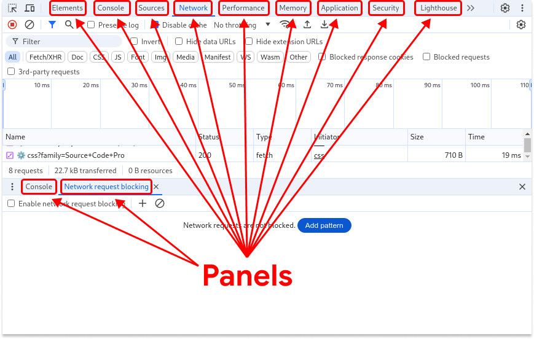
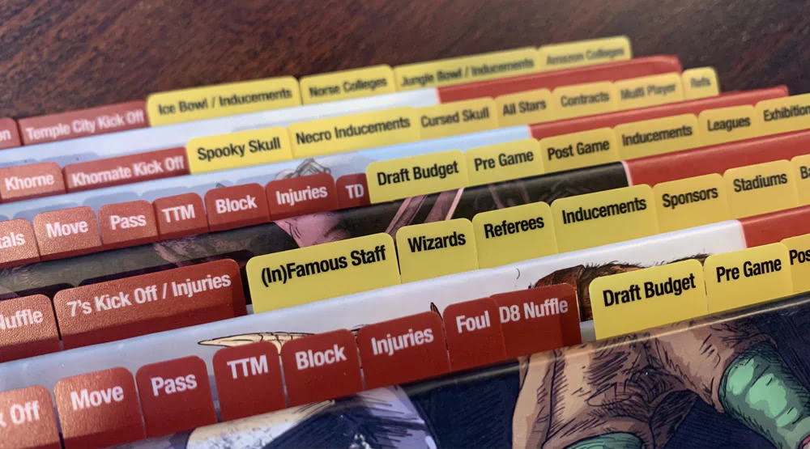

# Glossary

To stop mixing terms for UI elements across DevTools UI, its docs, and code, familiarize yourself with the terms in this glossary.

[TOC]

## Panel

A top-level tab in the DevTools window, including tabs from the **Drawer**
because you can [move them to the top](https://developer.chrome.com/docs/devtools/customize#reorder).

In other words, a panel is a fairly complex arrangement of information and
control elements put together on the basis of common sense.

Despite the fact that it's also a tab, the term "panel" has been in use for
ages and all users are familiar with it. At the time of writing, DevTools
has 32 panels.

*** aside
Example: **Elements**, **Console**, **Network**, and **Sources** panels.
***

## Tab

*Inside a panel*, one of the labeled "bookmarks" in a set. Opens a single
respective "page" (view) when you "pull" it.

In other words, a single-select switch between several distinct UI parts.
Can be arranged:

- Horizontally, like **Styles** ... **Properties** in **Elements**
- Vertically, like **Preferences** ... **Shortcuts** in **Settings**

*** aside
Examples: **Styles**, **Computed**, and **Properties** tabs inside the
**Elements** panel, or **Page**, **Workspace**, and **Snippets** tabs
inside the sidebar of the **Sources** panel.
***

## Section

A set of UI elements inside a panel and/or tab that is put together on the
basis of common sense. Use this term when other terms don't seem to apply.

*** aside
Example: **Watch**, **Breakpoints**, and other sections in the **Sources** >
**Debugger** sidebar.
***

## Datagrid, table

A spreadsheet-like tabular view of data with rows and columns.

*** aside
Example: The request table in the **Network** panel.
***

## Dialog [window]

A fairly small window that pops up over DevTools, communicates information,
and prompts for a response.

*** aside
Example: **Do you trust this code?** dialog in **Sources** > **Editor**.
***

## Sidebar

A set of UI elements, typically to the right or left side of a panel.
Sometimes can be closed or collapsed. Spelled without a space between
"side" and "bar".

*** aside
Example: **Navigator** and **Debugger** sidebars in **Sources**.
***

## Action bar

A bar with control elements, such as buttons, filters, checkboxes, and menus.
Typically located at the top.

*** aside
Example: Action bar at the top of the **Console**.
***

## Status bar

A bar with information and statistics, non-actionable. Typically located at
the bottom.

*** aside
Example: Status bar at the bottom of the **Network** panel.
***

## Navigation tree
A hierarchical tree-like structure that can have multiple levels of nesting.

*** aside
Example: File tree in the **Sources** > **Page** tab.
***

## Drop-down menu
A list of options that appears when you click the menu element.
Can have multi-select.

*** aside
Example: **Network** > **Throttling**.
***

## Context menu

A context-sensitive list of actions shown when you right-click an element.

## Tooltip

A small pop-up window with additional information that appears on hover.
Can have rich formatting.

## Controls

Graphical control elements, such as buttons, radio buttons, checkboxes, toggle
switches, sliders, scroll bars, text boxes, links, and others.

## Pane [DEPRECATED]

Deprecated. A duplicative and confusing term. Don't use.
