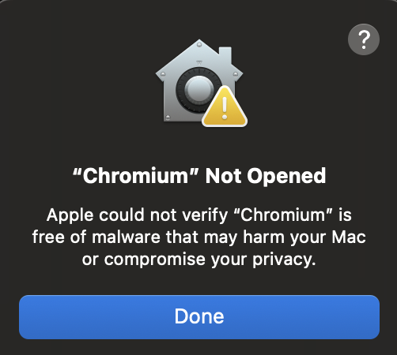
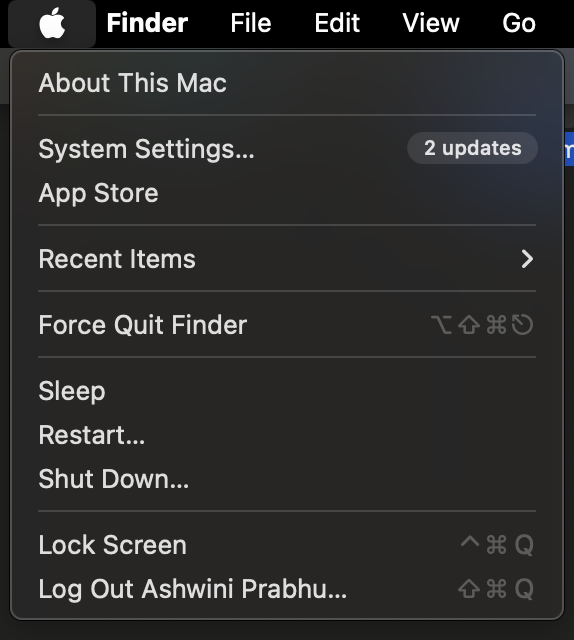
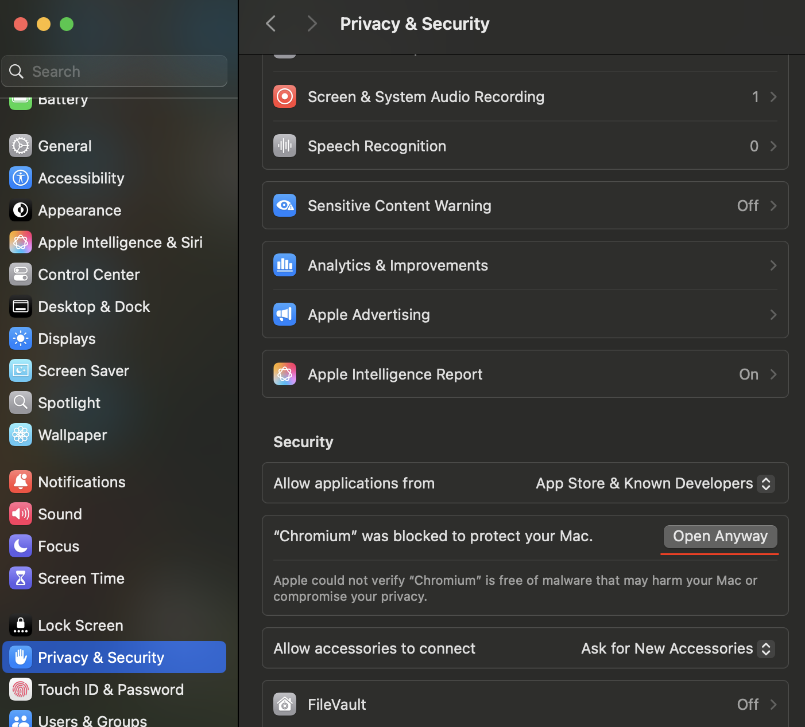

## Custom Chromium Build for macOS M-Series

### Introduction
This document guides you through installing a special version of the Chromium browser. This build includes experimental features, such as AI capabilities, that are currently under development.

**Warning:** This build includes experimental AI features. Using these features may involve sending data to external services for processing. For your privacy and security, please avoid entering sensitive personal or work information while using this build.

### Download
Please download the latest macOS build from the [releases page](https://github.com/tysonthomas9/browser-operator-devtools-frontend/releases).

### Updates
**Note:** This build does not include the standard Chromium auto-update feature. If you plan to use it regularly, please check the releases page weekly for the latest version. We are working on adding an official auto-update capability in the future.

### Installation Security Workaround
Because this build is not yet officially verified by Apple, macOS security settings will initially block the installation. Please follow these steps to allow the installation:

1.  Attempt to open the downloaded Chromium application file. You will likely see a warning message.

2. Open **System Settings** on your Mac and navigate to **Privacy & Security**.

3. Look for a message in the **Privacy & Security** settings window (usually near the bottom) mentioning that "Chromium" was blocked. Click the **"Open Anyway"** or **"Allow"** button next to this message.

4. You may need to confirm your intent again. After allowing it, try opening the Chromium application file again to proceed with the installation or first run.

### Using AI Features
This build contains experimental AI agents. To enable and use these features, you will need an API key from OpenAI. If you do not have one or are unfamiliar with OpenAI API keys, you can learn more and obtain one from the [OpenAI website](https://openai.com/). You will be prompted to enter this key within the browser's AI panel when you first try to use an AI feature.

Note: We plan to support additional operating systems such as linux and windows soon.

