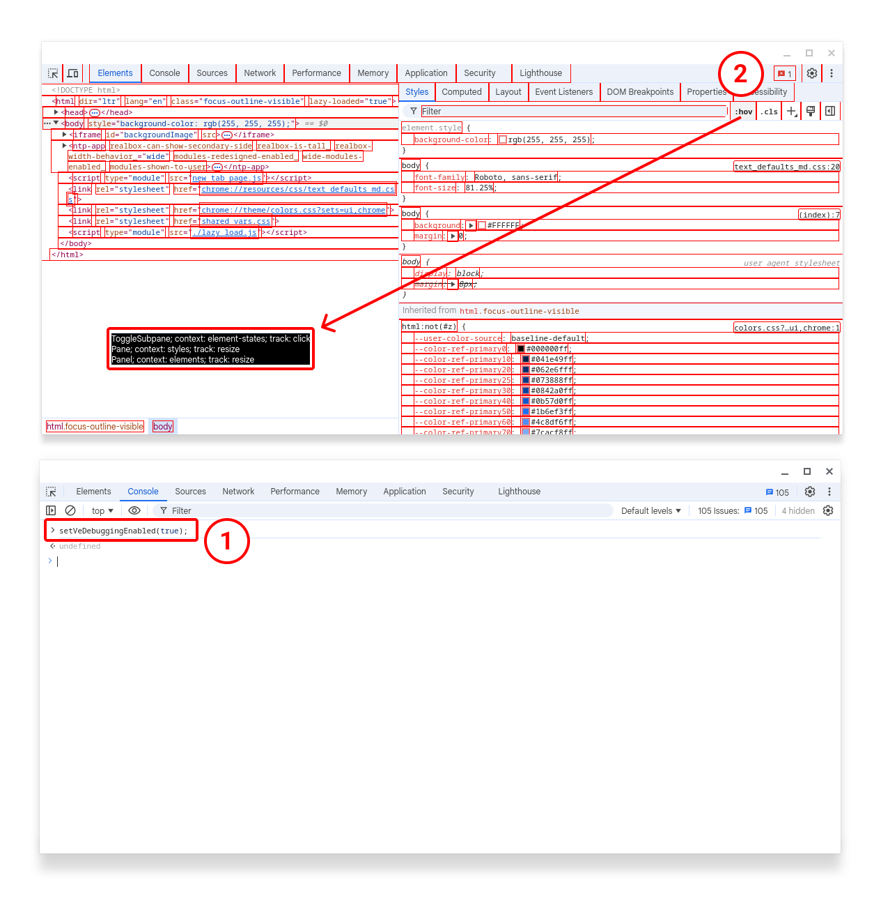

# Visual Logging in DevTools

[goo.gle/devtools-visual-logging](https://goo.gle/devtools-visual-logging)

Visual Element based logging aims to provide more reliable and consistent
logging than the previous UMA based logging approach, which could lead to
incorrect conclusions about how users are interacting with the product.

This new approach enables us to understand how users are interacting with
Chrome DevTools so that we can improve the product accordingly and optimize
the critical user journeys. This includes understanding what users are seeing,
what they are interacting with, and how they are using different features.

[TOC]

This feature is enabled by default as of Chromium M-124, and can be disabled
via the `--disable-features=DevToolsVeLogging` command line flag if needed.

## General approach

We log impressions and interactions for a subtree of the actual DevTools
DOM tree. The logging is based on an HTML attribute and an arbitrary context
value. The context value provides more information about the
element that is being logged.

The trickiest questions are what elements to log and how to describe them.
There are no hard rules here, we log what we think is helpful to understand user
behavior. Here are several rules of thumb:

1. Most of the interactive elements should be logged.
2. Elements that only appear under certain conditions should be logged.
3. Container elements that help distinguish common UI elements should be logged.

We describe loggable elements as a combination of visual element type and
context value. Visual element type is a value of `VisualElements` enum defined
in [`front_end/ui/visual_logging/LoggingConfig.ts`](./LoggingConfig.ts). Context
could be an arbitrary string, its 32 bit hash is logged. No taxonomy is perfect
and we are not trying to create one here, we are trying to make it practical
though.

1. Visual element types try to describe function, not appearance. For instance,
we have `Toggle` and `Action` as visual elements types, not `Checkbox` and
`Button`. This is important for keeping user actions trackable across longer time
frames, even if the appearance of UI elements change.
1. We also try to have visual element types describe classes of elements, and
context describe a specific instance. For example, we log the Elements panel as
a `Panel` visual element with `elements` as a context, not as `ElementsPanel`.
This not only helps to keep the number of visual element types reasonable, but
also makes it easier to compare relative performance of similar UI elements.
1. We log visual elements as a tree, so it is redundant to include location
information in either visual element type or context. For example, `TreeOutline`
inside `styles` `Pane` inside `elements` `Panel` is unambiguous by itself,
without any extra qualifiers.

## API

In most cases, it is enough to put the `jslog` attribute on a corresponding HTML
element. There’s a number of fluent builder functions exported
[`front_end/ui/visual_logging/visual_logging.ts`](./visual_logging.ts) to build
the attribute value. These are all bound versions of
`LoggingConfig.makeConfigStringBuilder` and are used in the legacy UI as:

```js
this.element.setAttribute('jslog', `${VisualLogging.panel(context)}`);
```

or

```js
button.element.setAttribute('jslog', `${VisualLogging.dropDown('rendering-emulations')
    .track({click: true})}`);
```

In LitHTML, the usage is:

```js
Lit.html`<td jslog=${VisualLogging.tableCell(/* context */ col.id)
        .track({click: true})}>
```

### `jslog` Builder API

The `track()` method generates a `track:` clause and specifies exactly what needs to
be logged for the visual elements. If not invoked, only impressions are logged for
this element. Called with tracking options, an object with the following boolean properties:
* `click`: Whether to track clicks.
* `dblclick`: Whether to track double clicks.
* `hover`: Whether to track hover events.
* `drag`: Whether to track drag events.
* `change`: Whether to track change events.
* `keydown`: Whether to track keydown events. This property can be boolean or string.
If a string is provided, it will be used as the key code to track. Otherwise, all keydown
events will be tracked.

The builder function accepts a `context` parameter, which sets the context for the visual
logging element. The context can be a string or a number. If a string is given, it is be
first considered to refer to a context provider (see below). If no context provider is
registered with this name, SHA-1 hash is computed and the first 32 bits
(little endian) is logged. Number will be logged as is.

The `parent()` method sets the custom parent provider for the visual logging element
(see below). If not invoked, the parent visual element is taken from a DOM tree structure.

### Context and parent providers

Context providers are used to generate context value in a runtime. It is used
for both impressions and events. This is useful when relevant information is not
reflected in the DOM, for example when a pseudo-element is used to render a tree item
disclosure triangle or canvas is used to draw network waterfall. When logging
impressions, context may indicate if or how many elements are present (0 or 1 for
having a disclosure triangle or not; number of tracks in the waterfall). When
logging events, context could identify what was clicked (1 for disclosure
triangle, 0 for tree item itself, sequence number of a waterfall track).

As this only logs a single number, it's not enough for more complex cases,
like diverse tracks in the Performance panel canvas, or hosted menu. For these
scenarios, see the section below.

To register a context provider, call `VisualLogging.registerContextProvider`.
First argument is a provider name that is later used as an argument in the
`jslog` builder `context()` method. Second is a function that takes an Element or Event
and returns a number. For a disclosure triangle, this is as follows:

```js
function disclosureTriangleLoggingContextProvider(
    e: VisualLogging.Loggable|Event): Promise<number|undefined> {
  if (e instanceof Element) {
    return Promise.resolve(e.classList.contains('parent') ? 1 : 0);
  }
  if (e instanceof MouseEvent && e.currentTarget instanceof Node) {
    const treeElement = TreeElement.getTreeElementBylistItemNode(e.currentTarget);
    if (treeElement) {
      return Promise.resolve(treeElement.isEventWithinDisclosureTriangle(e) ? 1 : 0);
    }
  }
  return Promise.resolve(undefined);
}


VisualLogging.registerContextProvider('disclosureTriangle',
    disclosureTriangleLoggingContextProvider);

listItemNode.setAttribute('jslog', `${VisualLogging.treeItem()
    .track({click: true}).context('disclosureTriangle')}`);
```

Similarly parent provides are used to specify parent visual elements in
runtime. This should be used rarely because, most of the time, DOM hierarchy is enough
to identify the parent. However, sometimes, markup doesn’t reflect the logical
structure, for example, when a legacy tree outline has children in an `<ol>` element, which is a
sibling of `<li>` that specifies the parent. In this case, you can do the following:

```js
function loggingParentProvider(e: Element): Element|undefined {
  const treeElement = TreeElement.getTreeElementBylistItemNode(e);
  return treeElement?.parent?.listItemElement;
}

VisualLogging.registerParentProvider('parentTreeItem',
        loggingParentProvider);

this.listItemNode.setAttribute(
       'jslog',
       `${VisualLogging.treeItem().track({click: true}).parent('parentTreeItem')}`);
```

### Logging beyond DOM

Some DevTools UI is not represented in DOM, such as tracks in the Performance
panel or native menus. To log these, the visual logging library provides an
imperative API. Use it rarely, when no other options are
available because it requires manual orchestration and is subject to the same issues
as UMA histogram logging.

First, identify the TypeScript type that corresponds/ to the element that
needs to be logged. For example, `ContextMenuDescriptor` is used to log native
menu items. This type needs to be added to the `Loggable` type definition in
[`front_end/ui/visual_logging/Loggable.ts`](./Loggable.ts).


Then call `registerLoggable` with the corresponding JavaScript
object, config string in the same format as the `jslog` attribute would have,
and an optional parent JavaScript object. For a native menu item, this is:


```js
VisualLogging.registerLoggable(descriptor, `${VisualLogging.action()
    .track({click: true}).context(descriptor.jslogContext)}`,
    parent || descriptors);
```

This only registers the element and doesn’t log anything yet. To log
impressions, explicitly call `VisualLogging.logImpressions`.
Similarly to log click, call `VisualLogging.logClick`.

## Debugging

You may find it useful to see which UI elements are annotated and how the tree
structure look like. To do that, run

```js
setVeDebuggingEnabled(true);
```

in DevTools on DevTools. This will add red outline to each visual element and
will show the details of logging config for an element and all its ancestors on
hover.



You can also run `setVeDebugLoggingEnabled(true)` in DevTools on DevTools. This
will cause each VE log to be also logged to the DevTools on DevTools console.
They will also be stored in the global variable `veDebugEventsLog`.
