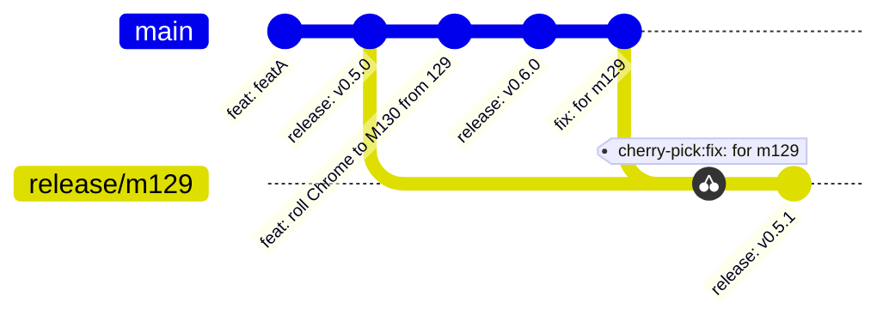

# WebDriver BiDi for Chromium [](https://www.npmjs.com/package/chromium-bidi)

## CI status


This is an implementation of the
[WebDriver BiDi](https://w3c.github.io/webdriver-bidi/) protocol with some
extensions (**BiDi+**)
for Chromium, implemented as a JavaScript layer translating between BiDi and CDP,
running inside a Chrome tab.

Current status can be checked
at [WPT WebDriver BiDi status](https://wpt.fyi/results/webdriver/tests/bidi).

## BiDi+

**"BiDi+"** is an extension of the WebDriver BiDi protocol. In addition to [WebDriver BiDi](https://w3c.github.io/webdriver-bidi/) it has:

### Command `goog:cdp.sendCommand`

```cddl
CdpSendCommandCommand = {
  method: "goog:cdp.sendCommand",
  params: CdpSendCommandParameters,
}

CdpSendCommandParameters = {
   method: text,
   params: any,
   session?: text,
}

CdpSendCommandResult = {
   result: any,
   session: text,
}
```

The command runs the
described [CDP command](https://chromedevtools.github.io/devtools-protocol)
and returns the result.

### Command `goog:cdp.getSession`

```cddl
CdpGetSessionCommand = {
   method: "goog:cdp.getSession",
   params: CdpGetSessionParameters,
}

CdpGetSessionParameters = {
   context: BrowsingContext,
}

CdpGetSessionResult = {
   session: text,
}
```

The command returns the default CDP session for the selected browsing context.

### Command `goog:cdp.resolveRealm`

```cddl
CdpResolveRealmCommand = {
   method: "goog:cdp.resolveRealm",
   params: CdpResolveRealmParameters,
}

CdpResolveRealmParameters = {
   realm: Script.Realm,
}

CdpResolveRealmResult = {
   executionContextId: text,
}
```

The command returns resolves a BiDi realm to its CDP execution context ID.

### Events `goog:cdp`

```cddl
CdpEventReceivedEvent = {
   method: "goog:cdp.<CDP Event Name>",
   params: CdpEventReceivedParameters,
}

CdpEventReceivedParameters = {
   event: text,
   params: any,
   session: text,
}
```

The event contains a CDP event.

### Field `goog:channel`

Each command can be extended with a `goog:channel`:

```cddl
Command = {
   id: js-uint,
   "goog:channel"?: text,
   CommandData,
   Extensible,
}
```

If provided and non-empty string, the very same `goog:channel` is added to the response:

```cddl
CommandResponse = {
   id: js-uint,
   "goog:channel"?: text,
   result: ResultData,
   Extensible,
}

ErrorResponse = {
  id: js-uint / null,
  "goog:channel"?: text,
  error: ErrorCode,
  message: text,
  ?stacktrace: text,
  Extensible
}
```

When client uses
commands [`session.subscribe`](https://w3c.github.io/webdriver-bidi/#command-session-subscribe)
and [`session.unsubscribe`](https://w3c.github.io/webdriver-bidi/#command-session-unsubscribe)
with `goog:channel`, the subscriptions are handled per channel, and the corresponding
`goog:channel` filed is added to the event message:

```cddl
Event = {
  "goog:channel"?: text,
  EventData,
  Extensible,
}
```

## Dev Setup

### `npm`

This is a Node.js project, so install dependencies as usual:

```sh
npm install
```

### `cargo`

<!-- TODO(jrandolf): Remove after binaries get published -->

We use [cddlconv](https://github.com/google/cddlconv) to generate our WebDriverBiDi types before building.

1.  Install [Rust](https://rustup.rs/).
2.  Run `cargo install --git https://github.com/google/cddlconv.git cddlconv`

### pre-commit.com integration

Refer to the documentation at [.pre-commit-config.yaml](.pre-commit-config.yaml).

```sh
pre-commit install --hook-type pre-push
```

Re-installing pre-commit locally:

```
pre-commit clean && pip install pre-commit
```

### Starting WebDriver BiDi Server

This will run the server on port `8080`:

```sh
npm run server
```

Use the `PORT=` environment variable or `--port=` argument to run it on another port:

```sh
PORT=8081 npm run server
npm run server -- --port=8081
```

Use the `DEBUG` environment variable to see debug info:

```sh
DEBUG=* npm run server
```

Use the `DEBUG_DEPTH` (default: `10`) environment variable to see debug deeply nested objects:

```sh
DEBUG_DEPTH=100 DEBUG=* npm run server
```

Use the `CHANNEL=...` environment variable with one of the following values to run
the specific Chrome channel: `stable`, `beta`, `canary`, `dev`, `local`. Default is
`local`. The `local` channel means the pinned in `.browser` Chrome version will be
downloaded if it is not yet in cache. Otherwise, the requested Chrome version should
be installed.

```sh
CHANNEL=dev npm run server
```

Use the CLI argument `--verbose` to have CDP events printed to the console. Note: you have to enable debugging output `bidi:mapper:debug:*` as well.

```sh
DEBUG=bidi:mapper:debug:* npm run server -- --verbose
```

or

```sh
DEBUG=* npm run server -- --verbose
```

### Starting on Linux and Mac

TODO: verify it works on Windows.

You can also run the server by using `npm run server`. It will write
output to the file `log.txt`:

```sh
npm run server -- --port=8081 --headless=false
```

### Running with in other project

Sometimes it good to verify that a change will not affect thing downstream for other packages.
There is a useful `puppeteer` label you can add to any PR to run Puppeteer test with your changes.
It will bundle `chromium-bidi` and install it in Puppeteer project then run that package test.

## Running

### Unit tests

Running:

```sh
npm run unit
```

### E2E tests

The e2e tests serve the following purposes:

1. Brief checks of the scenarios (the detailed check is done in WPT)
2. Test Chromium-specific behavior nuances
3. Add a simple setup for engaging the specific command

The E2E tests are written using Python, in order to more-or-less align with the web-platform-tests.

#### Installation

Python 3.10+ and some dependencies are required:

```sh
python -m pip install --user pipenv
pipenv install
```

#### Running

The E2E tests require BiDi server running on the same host. By default, tests
try to connect to the port `8080`. The server can be run from the project root:

```sh
npm run e2e  # alias to to e2e:headless
npm run e2e:headful
npm run e2e:headless
```

This commands will run `./tools/run-e2e.mjs`, which will log the PyTest output to console,
Additionally the output is also recorded under `./logs/<DATE>.e2e.log`, this will contain
both the PyTest logs and in the event of `FAILED` test all the Chromium-BiDi logs.

If you need to see the logs for all test run the command with `VERBOSE=true`.

Simply pass `npm run e2e -- tests/<PathOrFile>` and the e2e will run only the selected one.
You run a specific test by running `npm run e2e -- -k <TestName>`.

Use `CHROMEDRIVER` environment to run tests in `chromedriver` instead of NodeJS runner:

```shell
CHROMEDRIVER=true npm run e2e
```

Use the `PORT` environment variable to connect to another port:

```sh
PORT=8081 npm run e2e
```

Use the `HEADLESS` to run the tests in headless (new or old) or headful modes.
Values: `new`, `old`, `false`, default: `new`.

```sh
HEADLESS=new npm run e2e
```

#### Updating snapshots

```sh
npm run e2e -- --snapshot-update true
```

See https://github.com/tophat/syrupy for more information.

### Local http server

E2E tests use local http
server [`pytest-httpserver`](https://pytest-httpserver.readthedocs.io/), which is run
automatically with the tests. However,
sometimes it is useful to run the http server outside the test
case, for example for manual debugging. This can be done by running:

```sh
pipenv run local_http_server
```

...or directly:

```sh
python tests/tools/local_http_server.py
```

### Examples

Refer to [examples/README.md](examples/README.md).

## WPT (Web Platform Tests)

WPT is added as
a [git submodule](https://git-scm.com/book/en/v2/Git-Tools-Submodules). To get run
WPT tests:

### Check out and setup WPT

#### 1. Check out WPT

```sh
git submodule update --init
```

#### 2. Go to the WPT folder

```sh
cd wpt
```

#### 3. Set up virtualenv

Follow the [_System
Setup_](https://web-platform-tests.org/running-tests/from-local-system.html#system-setup)
instructions.

#### 4. Setup `hosts` file

Follow
the [`hosts` File Setup](https://web-platform-tests.org/running-tests/from-local-system.html#hosts-file-setup)
instructions.

##### 4.a On Linux, macOS or other UNIX-like system

```sh
./wpt make-hosts-file | sudo tee -a /etc/hosts
```

##### 4.b On **Windows**

This must be run in a PowerShell session with Administrator privileges:

```sh
python wpt make-hosts-file | Out-File $env:SystemRoot\System32\drivers\etc\hosts -Encoding ascii -Append
```

If you are behind a proxy, you also need to make sure the domains above are excluded
from your proxy lookups.

#### 5. Set `BROWSER_BIN`

Set the `BROWSER_BIN` environment variable to a Chrome, Edge or Chromium binary to launch.
For example, on macOS:

```sh
# Chrome
export BROWSER_BIN="/Applications/Google Chrome Canary.app/Contents/MacOS/Google Chrome Canary"
export BROWSER_BIN="/Applications/Google Chrome Dev.app/Contents/MacOS/Google Chrome Dev"
export BROWSER_BIN="/Applications/Google Chrome Beta.app/Contents/MacOS/Google Chrome Beta"
export BROWSER_BIN="/Applications/Google Chrome.app/Contents/MacOS/Google Chrome"
export BROWSER_BIN="/Applications/Chromium.app/Contents/MacOS/Chromium"

# Edge
export BROWSER_BIN="/Applications/Microsoft Edge Canary.app/Contents/MacOS/Microsoft Edge Canary"
export BROWSER_BIN="/Applications/Microsoft Edge.app/Contents/MacOS/Microsoft Edge"
```

### Run WPT tests

#### 1. Make sure you have Chrome Dev installed

https://www.google.com/chrome/dev/

#### 2. Build Chromedriver BiDi

Oneshot:

```sh
npm run build
```

Continuously:

```sh
npm run build --watch
```

#### 3. Run

```sh
npm run wpt -- webdriver/tests/bidi/
```

### Update WPT expectations if needed

```sh
UPDATE_EXPECTATIONS=true npm run wpt -- webdriver/tests/bidi/
```

## How does it work?

The architecture is described in the
[WebDriver BiDi in Chrome Context implementation plan](https://docs.google.com/document/d/1VfQ9tv0wPSnb5TI-MOobjoQ5CXLnJJx9F_PxOMQc8kY)
.

There are 2 main modules:

1. backend WS server in `src`. It runs webSocket server, and for each ws connection
   runs an instance of browser with BiDi Mapper.
2. front-end BiDi Mapper in `src/bidiMapper`. Gets BiDi commands from the backend,
   and map them to CDP commands.

## Contributing

The BiDi commands are processed in the `src/bidiMapper/commandProcessor.ts`. To add a
new command, add it to `_processCommand`, write and call processor for it.

### Publish new `npm` release

#### Release branches

`chromium-bidi` maintains release branches corresponding to Chrome releases. The
branches are named using the following pattern: `releases/m$MAJOR_VERSION`.

The new release branch is created as soon a new major browser version is
published by the
[update-browser-version](https://github.com/GoogleChromeLabs/chromium-bidi/blob/main/.github/workflows/update-browser-version.yml)
job:

- the PR created by this job should be marked as a feature and it should cause the
  major package version to be bumped.
- once the browser version is bumped, the commit preceding the version bump
  should be used to create a release branch for major version pinned before the bump.

Changes that need to be cherry-picked into the release branch should be marked
as patches. Either major or minor version bumps are not allowed on the release
branch.

Example workflow:



Currently, the releases from release branches are not automated.

#### Automatic release

We use [release-please](https://github.com/googleapis/release-please) to automate releases. When a release should be done, check for the release PR in our [pull requests](https://github.com/GoogleChromeLabs/chromium-bidi/pulls) and merge it.

#### Manual release

1. Dry-run

   ```sh
   npm publish --dry-run
   ```

1. Open a PR bumping the chromium-bidi version number in `package.json` for review:

   ```sh
   npm version patch -m 'chore: Release v%s' --no-git-tag-version
   ```

   Instead of `patch`, use `minor` or `major` [as needed](https://semver.org/).

1. After the PR is reviewed, [create a GitHub release](https://github.com/GoogleChromeLabs/chromium-bidi/releases/new) specifying the tag name matching the bumped version.
   Our CI then automatically publishes the new release to npm based on the tag name.

#### Roll into Chromium

This section assumes you already have a Chromium set-up locally,
and knowledge on [how to submit changes to the repo](https://chromium.googlesource.com/chromium/src/+/refs/heads/main/docs/contributing.md).
Otherwise submit an issue for a project maintainer.

1. Create a new branch in chromium `src/`.
2. Update the mapper version:

```shell
third_party/bidimapper/roll_bidimapper
```

3. Submit a CL with bug `42323268` ([link](https://crbug.com/42323268)).

4. [Regenerate WPT expectations or baselines](https://chromium.googlesource.com/chromium/src/+/HEAD/docs/testing/run_web_platform_tests.md#test-expectations-and-baselines):

   4.1. Trigger a build and test run:

   ```shell
   third_party/blink/tools/blink_tool.py rebaseline-cl --build="linux-blink-rel" --verbose
   ```

   4.2. Once the test completes on the builder, rerun that command to update the
   baselines. Update test expectations if there are any crashes or timeouts.
   Commit the changes (if any), and upload the new patch to the CL.

5. Add appropriate reviewers or comment the CL link on the PR.

## Adding new command

Want to add a shiny new command to WebDriver BiDi for Chromium? Here's the playbook:

### Prerequisites

#### Specification

The WebDriver BiDi [module](https://w3c.github.io/webdriver-bidi/#protocol-modules), [command](https://w3c.github.io/webdriver-bidi/#commands), or [event](https://w3c.github.io/webdriver-bidi/#events) must be specified either in the [WebDriver BiDi specification](https://w3c.github.io/webdriver-bidi) or as an extension in a separate specification (e.g., the [Permissions specification](https://www.w3.org/TR/permissions/#automation-webdriver-bidi)). The specification should include the command's type definitions in valid [CDDL](https://datatracker.ietf.org/doc/html/rfc8610) format.

#### WPT wdspec tests

You'll need tests to prove your command works as expected. These tests should be written using [WPT wdspec](https://web-platform-tests.org/writing-tests/wdspec.html) and submitted along with the spec itself. Don't forget to roll the WPT repo into the Mapper ([dependabot](https://github.com/GoogleChromeLabs/chromium-bidi/network/updates/10663151/jobs) can help, and you will likely need to tweak some expectations afterward).

#### CDP implementation

Make sure Chromium already has the CDP methods your command will rely on.

### Update CDDL types

1. If your command lives in a separate spec, add a link to that spec in the ["Build WebDriverBiDi types"](https://github.com/GoogleChromeLabs/chromium-bidi/blob/0f971303281aba1910786035facc5eb54a833232/.github/workflows/update-bidi-types.yml#L27) GitHub action (check out the ["bluetooth" pull request](https://github.com/GoogleChromeLabs/chromium-bidi/pull/2585) for an example).
2. Run the ["Update WebdriverBiDi types"](https://github.com/GoogleChromeLabs/chromium-bidi/actions/workflows/update-bidi-types.yml) GitHub action. This will create a pull request with your new types. If you added a command, this PR will have a failing check complaining about a non-exhaustive switch statement:
   > error: Switch is not exhaustive. Cases not matched: "{NEW_COMMAND_NAME}" @typescript-eslint/switch-exhaustiveness-check
3. Update the created pull request. Add your new command to [`CommandProcessor.#processCommand`](https://github.com/GoogleChromeLabs/chromium-bidi/blob/0f971303281aba1910786035facc5eb54a833232/src/bidiMapper/CommandProcessor.ts#L140). For now, just have it throw an UnknownErrorException (see the [example](https://github.com/GoogleChromeLabs/chromium-bidi/pull/2647/files#diff-7f06ce28b8514fd75b759d217bff9f5a471b657bcf78bd893cc291c7945c1cacR169) for how to do this).

```typescript
case '{NEW_COMMAND_NAME}':
  throw new UnknownErrorException(
    `Method ${command.method} is not implemented.`,
  );
```

4. Merge it! Standard PR process: create, review, merge.

### Implement the new command

[`CommandProcessor.#processCommand`](https://github.com/GoogleChromeLabs/chromium-bidi/blob/0f971303281aba1910786035facc5eb54a833232/src/bidiMapper/CommandProcessor.ts#L140) handles parsing parameters and running your command.

#### (only if the new command has non-empty parameters) parse command parameters

If your command has parameters, update the [`BidiCommandParameterParser`](https://github.com/GoogleChromeLabs/chromium-bidi/blob/0f971303281aba1910786035facc5eb54a833232/src/bidiMapper/BidiParser.ts#L31) and implement the parsing logic in [`BidiNoOpParser`](https://github.com/GoogleChromeLabs/chromium-bidi/blob/0f971303281aba1910786035facc5eb54a833232/src/bidiMapper/BidiNoOpParser.ts#L209), [`BidiParser`](https://github.com/GoogleChromeLabs/chromium-bidi/blob/0f971303281aba1910786035facc5eb54a833232/src/bidiTab/BidiParser.ts#L182) and [`protocol-parser`](https://github.com/GoogleChromeLabs/chromium-bidi/blob/0f971303281aba1910786035facc5eb54a833232/src/protocol-parser/protocol-parser.ts#L386). Look at the [example](https://github.com/GoogleChromeLabs/chromium-bidi/blob/0f971303281aba1910786035facc5eb54a833232/src/bidiMapper/BidiParser.ts#L97) for guidance.

#### Implement the new command

Write the core logic for your command in the appropriate domain processor. Again, [example](https://github.com/GoogleChromeLabs/chromium-bidi/blob/0f971303281aba1910786035facc5eb54a833232/src/bidiMapper/modules/permissions/PermissionsProcessor.ts#L32) is your friend.

#### Call the module processor's method

Call your new module processor method from `CommandProcessor.#processCommand`, passing in the parsed parameters. [Example](https://github.com/GoogleChromeLabs/chromium-bidi/blob/0f971303281aba1910786035facc5eb54a833232/src/bidiMapper/CommandProcessor.ts#L313).

#### Add e2e tests

Write end-to-end tests for your command, including the happy path and any edge cases that might trip things up. Focus on testing the code in the mapper.

#### Update WPT expectations

Your WPT tests will probably fail now.

> Tests with unexpected results: PASS [expected FAIL] ...

Update the expectations in a draft PR with the "update-expectations" label. This will trigger an automated PR "test: update the expectations for PR" that you'll need to merge to your branch.

#### Merge it!

Mark your PR as ready, get it reviewed, and merge it in.

### Roll in ChromeDriver

This bit usually involves the core devs:

1. [Release](#automatic-release) your changes.
2. [Roll the changes into ChromeDriver](#roll-into-chromium).
