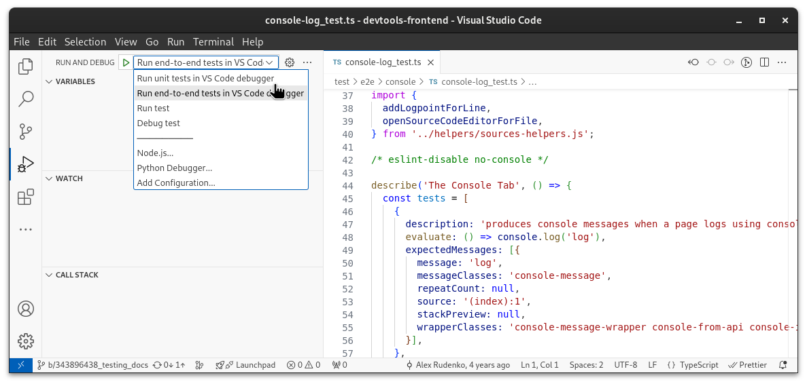

# E2E Testing

This directory hosts the end-to-end tests we run on DevTools. These tests open a target page and a DevTools frontend page, for which the DevTools frontend connects to the target page over CDP. We use [Puppeteer] to talk over CDP and all functionality of Puppeteer is available to you as well when writing end-to-end tests. We use [Mocha] as testing framework.

The goal of these end-to-end tests is to implement core user journeys throughout the application. As such, the tests you write should read like a little story that you can read, even if you don't know how it is implemented.

The tests therefore have a dual purpose:

1. Verify that core user stories are working as intended and are not broken by a particular DevTools frontend change.
1. Serve as documentation and reference point for how DevTools is intended to be used.

[TOC]

## Running E2E tests

The end-to-end tests are implicitly run as part of `npm run test`,
but that also runs all the other test suites. To run only
**all end-to-end tests**, use:

```
npm run test test/e2e
```

To use `out/Debug` instead of the default `out/Default` target
directory, use:

```
npm run test -- -t Debug test/e2e
```

To run the end-to-end tests in **debug mode**, use:

```
npm run test -- --debug test/e2e
```

To run only **specific end-to-end tests** from a single `_test.ts`
file, say `console-log_test.ts` for example, use:

```
npm run test test/e2e/console/console-log_test.ts
```

Check the output of `npm run test -- --help` for an overview of
all options.

## Debugging E2E tests

You can debug the "DevTools under test" with DevTools-on-DevTools. Use the
standard DevTools key combination to open another DevTools instance while
you look at the "DevTools under test". You can set breakpoints and inspect
the status of the "DevTools under test" this way. You can debug the puppeteer
side by inspecting the Node.js process that runs the e2e suite. Either open
`chrome://inspect` or click the Node.js icon in any open DevTools window to
connect to the puppeteer process. You can step through the puppeteer test
code this way.

To listen to the frontend's console:

```js
getBrowserAndPages().frontend.on('console', msg => console.log(msg.text()));
```

### Debugging E2E tests with VSCode

There's experimental support for running unit tests directly from
within VSCode. Open the "Run and Debug" sidebar, select "Run end-to-end tests
in VS Code debugger" from the dropdown, and click the start button or
press F5.



Current limitations when using VSCode for e2e and interactions tests:

- VSCode only attaches to the node portion of the code (mostly the test files
  and the test helpers), not to Chrome.
- VSCode debugging only works with headless mode.

## Dealing with flaky E2E tests

To skip a flaky E2E test, create a new bug on [crbug.com](https://crbug.com) in the
`Chromium > Platform > DevTools` component, and modify the `it` or `describe`
block accordingly by adding `.skip` to it, adding a preceeding comment
why the test is skipp and adding the `crbug.com` reference to the test
block string. For example

```js
describe('Foo', () => {
  it('can return bar', () => {
    assert.strictEqual((new Foo()).bar(), 'bar');
  });

  ...
});
```

would be changed to look like this

```js
describe('Foo', () => {
  // Flaking on multiple bots on CQ after recent CL xyz.
  it.skip('[crbug.com/12345678] can return bar', () => {
    assert.strictEqual((new Foo()).bar(), 'bar');
  });

  ...
});
```

if only the one test case should be skipped, or like this

```js
// Flaking on multiple bots on CQ after recent CL xyz.
describe.skip('[crbug.com/12345678] Foo', () => {
  it('can return bar', () => {
    assert.strictEqual((new Foo()).bar(), 'bar');
  });

  ...
});
```

if all the tests for `Foo` should be skipped. Note that it is preferable to
skip individual tests so that test results list the skipped tests, rather than
skipping groups of tests.

If you are disabling a flaky test, consider disabling it only on the affected
platforms. For example:

```js
// Consistently flakes on Mac and Windows bots.
it.skipOnPlatforms(['mac', 'win32'], '[crbug.com/xxx] ...', () => {...});

// Skipped on Linux because the world isn't round.
it.skipOnPlatforms(['linux'], '[crbug.com/xxx] ...', () => {...});
```

### De-flaking E2E tests

The `it.repeat` helper is useful for reproducing a flaky test failure. e.g.

```js
it.repeat(20, 'find element', async () => {...});
```

`it.repeat` behaves like `it.only` in that it will cause just that single test to be run.

To see if certain tests are flaky you can use the E2E stressor bots. Open a CL with your test changes and run the following command specifying your test file:

```sh
git cl try -B devtools-frontend/try -b e2e_stressor_linux -b e2e_stressor_win64 -b e2e_stressor_mac -p runner_args='test/e2e/sources/navigator-view_test.ts --repeat=80'
```

or multiple test files:

```sh
git cl try -B devtools-frontend/try -b e2e_stressor_linux -b e2e_stressor_win64 -b e2e_stressor_mac -p runner_args='test/e2e/sources/navigator-view_test.ts test/e2e/sources/snippets_test.ts --repeat=80'
```

This will run the specified tests on dedicated bots with the specified number of iterations. Note that in order for iterations to work the test should be using `it` from `mocha_extensions.ts`.

The following command runs the stressor bot on all files of the latest commit with reasonable settings:

```sh
git cl try -B devtools-frontend/try \
  -b e2e_stressor_linux \
  -p runner_args="\
    $(git diff-tree --no-commit-id --name-only HEAD -r | grep test/e2e | grep -v e2e/helpers | cut -c 10- - | tr "\n" " ") \
    --repeat=20"
```

> By default, tests are run using the debug build. To run it with the release build, append `-p builder_config=Release` to the end of the command.

Please use a reasonable number of iterations and include the minimal amount of test files to avoid overloading the bots. This bot is experimental and the parameters might change in the future.

## General implementation details

To that end, the "what" from the "how" are separate in end-to-end tests. The "what" is the actual end-to-end test. The "how" are functions in [helpers](helpers/) that implement the interaction with DevTools to perform a particular action.

For example, an end-to-end test might read like this:

```js
it("can show newly created snippets show up in command menu", async () => {
  await openSourcesPanel();
  await openSnippetsSubPane();
  await createNewSnippet("New snippet");

  await openCommandMenu();
  await showSnippetsAutocompletion();

  assert.deepEqual(await getAvailableSnippets(), ["New snippet\u200B"]);
});
```

The test describes the user journey and then describes what actions the user takes to fulfill that journey. For example, when the user wants to "open the command menu", that is an action performed. The implementation is separated in a helper that implements "how" the user performs that action.

The separation of the two concepts allows us to change the underlying implementation of the action while making sure that the user journey remains intact.

For example, this is the implementation of `openCommandMenu()`:

```js
export const openCommandMenu = async () => {
  const { frontend } = getBrowserAndPages();

  switch (platform) {
    case "mac":
      await frontend.keyboard.down("Meta");
      await frontend.keyboard.down("Shift");
      break;

    case "linux":
    case "win32":
      await frontend.keyboard.down("Control");
      await frontend.keyboard.down("Shift");
      break;
  }

  await frontend.keyboard.press("P");

  switch (platform) {
    case "mac":
      await frontend.keyboard.up("Meta");
      await frontend.keyboard.up("Shift");
      break;

    case "linux":
    case "win32":
      await frontend.keyboard.up("Control");
      await frontend.keyboard.up("Shift");
      break;
  }

  await waitFor(QUICK_OPEN_SELECTOR);
};
```

As you can see, the way the user opens the command menu is via key-bindings. We don't "bypass" the functionality by calling functions on components or on our models directly; we instruct Puppeteer to do exactly what a user would do. Doing so, we are certain that we don't test our component abstractions and potentially lose track of integration issues.

Secondly, the function has a `waitFor`, which waits for the command menu (found by the `QUICK_OPEN_SELECTOR`) to appear. For every action that is performed in DevTools, there must be a corresponding user-visible change in the UI. This means that you always have to wait for something to happen and you can't assume that, as soon as you have performed an action, the UI has updated accordingly.

**Note: Because of the async rendering of DevTools, content might not be strictly visible when DOM Nodes are appended to the DOM.** As such, be aware of the functionality you are testing and relying on, as it could render differently than you originally assumed.

To summarize:

1. Separate the "what" from the "how".
1. Use real actions (clicking, using key-bindings, typing) instead of "bypassing" via components/models.
1. Every action must be observed by a change in the UI and must be waited for.
1. Be aware of the async rendering of DevTools

## Helpers

There are two kinds of helpers:

1. Helpers written as part of the end-to-end test, implementing the "how" of user actions.
1. Helpers supplied to interact with a page and abstract away the way the tests are run.

The former are implemented in [helpers](helpers/), written by the DevTools maintainers and are specific to the implementation of the DevTools frontend. The latter are implemented in [../shared](../shared/), written by the Puppeteer maintainers and are predominantly DevTools-agnostic (apart from the handling of a target page + CDP connection).

In general, the e2e/helpers make use of the shared helpers. See [../shared/README.md](../shared/README.md) for more documentation on the shared helpers.

[puppeteer]: https://pptr.dev/
[mocha]: https://mochajs.org
