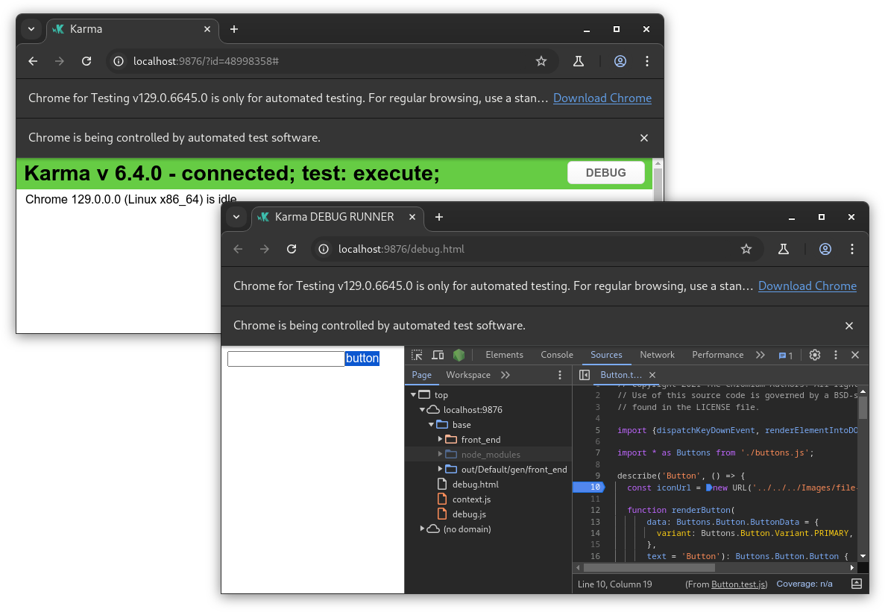
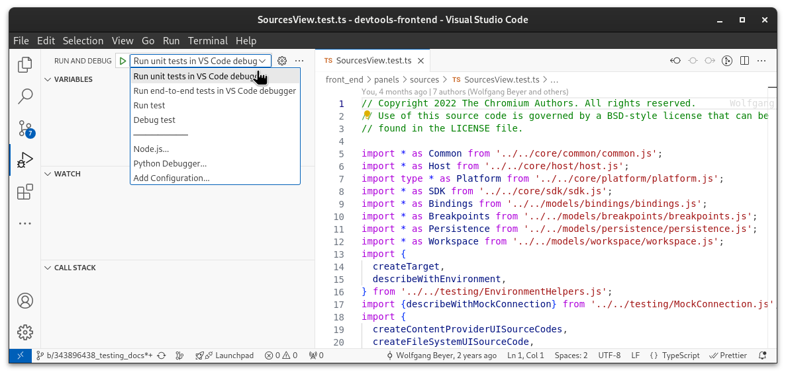

# Unit Testing

Unit tests are written using [Mocha](https://mochajs.org/) and
[Chai](https://www.chaijs.com/) and run with
[Karma](https://karma-runner.github.io/latest/index.html) in a web
browser. The unit tests live next to the source code they are
testing and follow the naming convention `Foo.test.ts` for `Foo.ts`.

[TOC]

## Running unit tests

The unit tests are implicitly run as part of `npm run test`,
but that also runs all the other test suites. To run only
**all unit tests**, use:

```
npm run test front_end
```

To use `out/Debug` instead of the default `out/Default` target
directory, use:

```
npm run test -- -t Debug front_end
```

To run the unit tests in **debug mode**, use:

```
npm run test -- --debug front_end
```

To run only **specific unit tests** from a single `.test.ts`
file, say `SourcesView.test.ts` for example, use:

```
npm run test front_end/panels/sources/SourcesView.test.ts
```

Check the output of `npm run test -- --help` for an overview of
all options.

### Running a subset of unit tests

If you want to run a specific (set of) unit test(s) and you don't want
to pass the name of the `.test.ts` file to `npm run test`, you can use
`it.only` or `describe.only` for those tests that you want to run.

```js
// Run only the tests within this `describe` block.
describe.only('The test suite that you want to run', () => {
  it('A test that would run', () => {});
  it('Another test that would run', () => {});
});

describe('The test suite that you want to run', () => {
  // Run only a single test.
  it.only('A test that would run', () => {});
  it('A test that would not run', () => {});
});
```

## Writing unit tests

All unit tests live in the `front_end` directory in the same folder as
the file that they are testing, with `.test.ts` extension instead of
`.ts`. For example, the unit tests for `Foo.ts` will end up in a file
`Foo.test.ts` next to it.

Checkout the [Unit Testing Helpers](../../front_end/testing/README.md)
documentation for details on various available helpers.

## Debugging unit tests

To debug unit tests with DevTools, start the test runner like this

```
npm run test -- --debug front_end
```

and optionally pass the (relative) path to the `.test.ts` file that
you want to debug. This will bring up Chrome with a Karma launcher
page.



Click on the "Debug" button, which opens a new page, on which
you can open DevTools, set breakpoints in the tests and reload the
page to rerun tests.

### Debugging unit tests with VSCode

There's experimental support for running unit tests directly from
within VSCode. Open the "Run and Debug" sidebar, select "Run unit tests
in VS Code debugger" from the dropdown, and click the start button or
press F5.



## Dealing with flaky unit tests

To skip a flaky unit test, create a new bug on [crbug.com](https://crbug.com) in the
`Chromium > Platform > DevTools` component, and modify the `it` or `describe`
block accordingly by adding `.skip` to it, adding a preceeding comment
why the test is skipp and adding the `crbug.com` reference to the test
block string. For example

```js
describe('Foo', () => {
  it('can return bar', () => {
    assert.strictEqual((new Foo()).bar(), 'bar');
  });

  // ...
});
```

would be changed to look like this

```js
describe('Foo', () => {
  // Flaking on multiple bots on CQ after recent CL xyz.
  it.skip('[crbug.com/12345678] can return bar', () => {
    assert.strictEqual((new Foo()).bar(), 'bar');
  });

  // ...
});
```

if only the one test case should be skipped, or like this

```js
// Flaking on multiple bots on CQ after recent CL xyz.
describe.skip('[crbug.com/12345678] Foo', () => {
  it('can return bar', () => {
    assert.strictEqual((new Foo()).bar(), 'bar');
  });

  // ...
});
```

if all the tests for `Foo` should be skipped.
